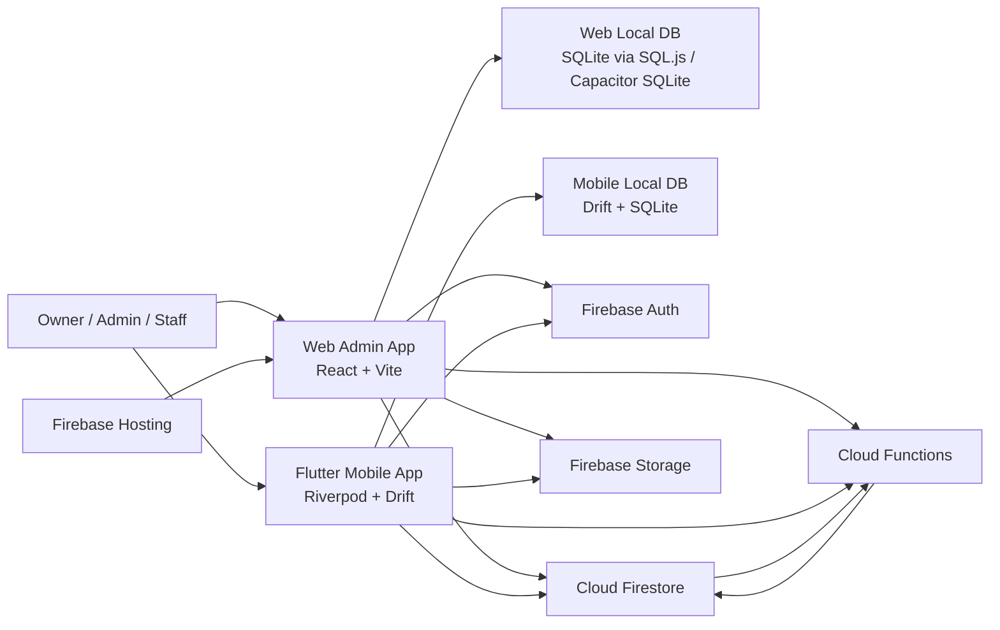
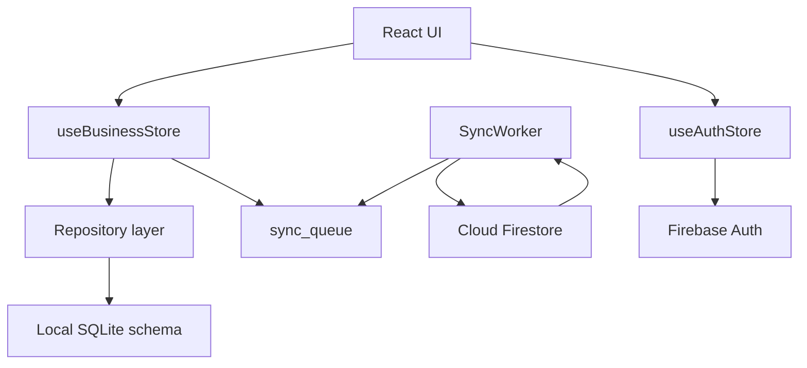
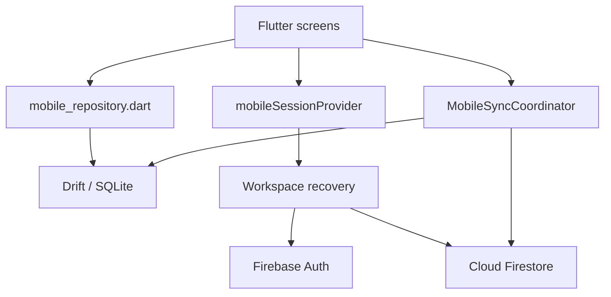
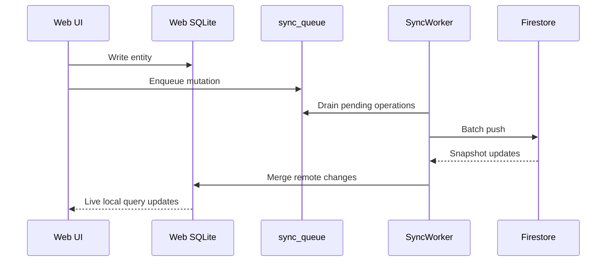
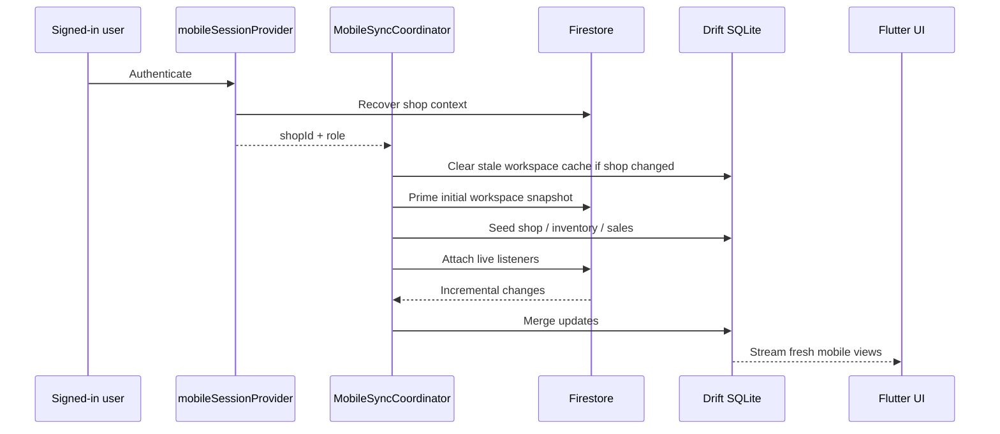
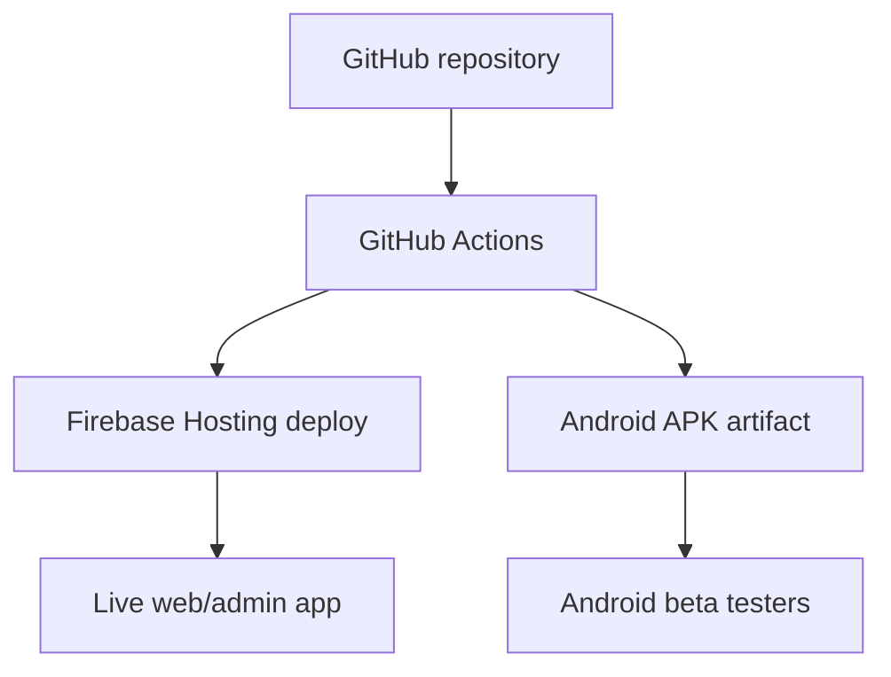

# Business Hub Architecture Overview

## Purpose

This document describes the current Business Hub platform architecture as it exists in this repository on April 28, 2026.

It covers:
- the live web/admin app
- the new Flutter mobile app
- Firebase backend services
- local-first storage and sync behavior
- current parity limits between old and new mobile implementations

## System context

## High-level component map

### 1. Web/admin application

Primary code:
- `src/`
- `src/lib/firebase.ts`
- `src/lib/useAuthStore.ts`
- `src/lib/useBusinessStore.ts`
- `src/sync/SyncWorker.ts`
- `src/db/schema.ts`

Core traits:
- React + Vite SPA
- Zustand for app/session state
- Local-first SQLite model
- Firestore sync worker with pull + outbox push
- Firebase Hosting deployment

Main responsibilities:
- full admin/operator workflow
- richer feature set than the Flutter app today
- normalized local business database
- offline-first entity editing
- local analytics and dashboard shaping

### 2. Flutter mobile application

Primary code:
- `apps/mobile_flutter/lib/`
- `apps/mobile_flutter/lib/core/session/mobile_session_controller.dart`
- `apps/mobile_flutter/lib/core/sync/mobile_sync_coordinator.dart`
- `apps/mobile_flutter/lib/core/database/local_database.dart`
- `apps/mobile_flutter/lib/core/database/mobile_repository.dart`

Core traits:
- Flutter + Material 3 dark theme
- Riverpod state management
- Drift + native SQLite
- cloud bootstrap followed by Firestore live listeners
- current focus: dashboard, inventory, POS foundation

Main responsibilities:
- performance-first mobile UX
- native local database
- faster catalog/POS opening than WebView-based mobile
- staged replacement for the older Capacitor mobile path

### 3. Firebase backend

Primary config and rules:
- `firebase.json`
- `firestore.rules`
- `storage.rules`
- `functions/src/index.ts`

Services in use:
- Firebase Auth
- Cloud Firestore
- Cloud Functions
- Firebase Storage
- Firebase Hosting
- App Check for web

Functions currently exposed include:
- staff claim management
- aggregate/summarization triggers
- background job handling
- messaging/observability hooks
- admin PIN/security endpoints
- AI/agent endpoints

## Runtime architecture

### Web/admin runtime

Important notes:
- the web app uses a much broader normalized local schema than the Flutter app today
- the web app can show local data that has not fully propagated to Firestore yet
- this is the main reason "web shows data but new mobile does not" can happen

### Flutter mobile runtime

Important notes:
- Flutter mobile currently uses a narrower local schema
- it now performs an initial Firestore bootstrap, then attaches live listeners
- current synced domains in Flutter are:
  - shop settings
  - inventory
  - inventory_private
  - sales

Not yet fully mirrored into Flutter local storage:
- customers
- customer payments
- expenses
- staff/staff_private local tables
- attendance
- invitations
- import/job system
- historical reporting surfaces

## Source-of-truth model

Business Hub is not a simple "read directly from Firestore on every screen" architecture.

There are three important truth layers:

1. **Cloud shared truth**
   - Firestore is the shared cross-device truth.
   - Anything not pushed to Firestore is not shared.

2. **Web operational local truth**
   - The web/admin app maintains a larger local SQLite model.
   - It can temporarily hold more data than the current Flutter app understands.

3. **Flutter mobile local truth**
   - The new Flutter app maintains its own Drift/SQLite cache.
   - It is intentionally narrower today for performance and controlled migration.

## Sync model

### Web sync path

### Flutter mobile sync path

## Security model

Authorization is layered:

1. Firebase Auth identifies the user.
2. Firestore rules enforce membership/admin/permission checks.
3. Staff permissions can come from:
   - custom auth claims
   - staff document role
   - staff document permission matrix

Key rules:
- `shops/{shopId}` readable by members or owner
- `inventory_private` requires cost permission
- `sales` creation validates discount override permissions
- `invitations`, `jobs`, `imports`, `backup_archives` are admin-only
- `private/*` is effectively blocked from client reads

## Current platform split

### Live web/admin app

Best choice for:
- full feature coverage
- mature workflows
- richer historical data handling
- broader operational tooling

### Flutter mobile app

Best choice for:
- future smooth mobile experience
- native SQLite performance
- mobile-focused dashboard/inventory/POS
- gradual replacement of laggy WebView-based mobile behavior

## Current risks and limitations

### 1. Feature parity is incomplete

Flutter mobile is not yet a full replacement for the old app.

Missing or partial areas include:
- customer management depth
- history/reporting depth
- team/settings parity
- scanner/barcode integration completion
- broader sync coverage outside core POS/inventory/sales

### 2. Local-cloud divergence is still possible

If old web data exists only in local SQLite and was never pushed to Firestore:
- web can show it
- Flutter cannot see it

### 3. Dual-local-schema period

Today the platform is in migration mode:
- old app local schema is broad and normalized
- Flutter local schema is lean and task-focused

This is intentional, but it means parity work is still ongoing.

## Deployment view

## Recommended next architecture steps

1. Expand Flutter local schema toward:
   - customers
   - customer payments
   - expenses
   - staff
   - attendance

2. Move Flutter from "core-sync subset" to "full operational sync".

3. Add explicit sync observability in Flutter:
   - last sync time
   - hydrated collection counts
   - outbox / failed push counts

4. Define production cutover criteria for mobile:
   - parity checklist
   - sync reliability checklist
   - multi-device QA scenarios

## Summary

Business Hub is currently a **hybrid local-first retail platform**:
- web/admin is the mature operational surface
- Flutter mobile is the performance-focused next-generation mobile surface
- Firestore is the shared cloud data backbone
- local SQLite remains the speed layer on both clients

The system is already architected for strong offline-first behavior, but full mobile parity still requires more schema and workflow migration into Flutter.
