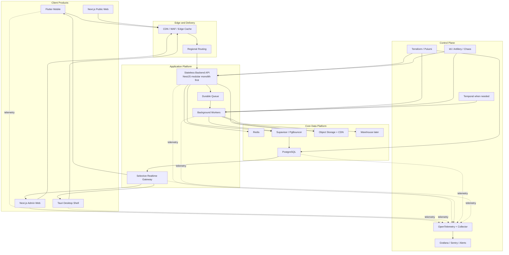

# Business Hub Complete Platform Handbook

## Purpose

This is the single-file, A-to-Z architecture and migration handbook for Business Hub.

It is designed to be the one document that answers:

- what Business Hub is today
- what Business Hub should become
- what stack to build now
- how the data model should look
- how Firebase should migrate to PostgreSQL
- how offline/mobile conflicts should be handled
- how scale, observability, queues, and control plane should work
- how the system behaves in real operational scenarios

This file is the top-level handbook for:

- founder decisions
- product planning
- backend design
- mobile/web design
- migration execution
- DevOps and control plane planning
- release and cutover planning

## Executive decision

### Final architecture decision

Business Hub should be built in **three tiers**:

### Tier A: Build now

- Flutter mobile
- Next.js admin web
- Next.js public web
- Tauri desktop shell where needed
- NestJS modular-monolith backend
- PostgreSQL as source of truth
- Redis for hot cache and coordination
- durable queue
- workers
- selective realtime
- OpenTelemetry + IaC from day one

### Tier B: Grow into

- multi-region deployment
- read replicas
- richer caching
- more projection tables
- stronger queue topology
- stronger chaos/load discipline
- Temporal for complex multi-step workflows where justified

### Tier C: Keep as future-only

- distributed SQL ledger like Spanner or CockroachDB
- Go/Rust ultra-fast ingestion API
- Kafka/PubSub first-hop transaction stream
- ledger commit pipeline
- extreme global ACID write architecture

### Bottom line

For Business Hub today:

- build **Tier A**
- prepare for **Tier B**
- document **Tier C** but do not build it unless the business truly reaches that class of scale

## Current reality

Business Hub currently has:

- a web/admin app that is the most feature-complete surface
- a new Flutter mobile app that is the performance-focused path forward
- Firebase as the shared cloud backend today
- local SQLite as the speed layer on clients

Current repo shape:

- `src/` = current web/admin app
- `apps/mobile_flutter/` = new Flutter mobile app
- `apps/desktop/` = desktop shell path
- `functions/` = Firebase Cloud Functions

Current truth:

- the old web/admin app is still richer
- the Flutter app is the future mobile path
- Firebase is still the shared operational cloud backbone today
- PostgreSQL is the recommended next source of truth

## Final platform architecture

## Frontend strategy

### Flutter mobile

Flutter becomes the primary mobile app because:

- it avoids WebView lag
- it gives better list scrolling and interaction performance
- it supports local SQLite well
- it is the right fit for offline-first POS behavior

Mobile rules:

- local SQLite first
- optimistic UI
- background sync
- offline outbox
- stale reconnect handled as command replay, not document overwrite

### Next.js admin web

Next.js should become the main admin/operator surface because:

- strong code splitting and caching model
- clean route structure
- better long-term split between admin and public web
- easier reuse in Tauri shell

### Next.js public web

Keep public web separate from heavy admin runtime.

Use it for:

- landing pages
- onboarding
- pricing
- marketing

### Tauri desktop shell

Use Tauri only where packaged desktop matters:

- native-feeling desktop distribution
- lower memory than heavier wrappers
- reuse of the admin web UI

## Backend strategy

### Primary recommendation

Use a **NestJS modular monolith first**.

Why:

- simpler than microservices
- faster to ship
- clear module boundaries
- still allows later extraction of hot paths

Recommended backend modules:

- auth
- users
- shops
- memberships
- inventory
- sales
- customers
- expenses
- attendance
- jobs
- imports
- exports
- notifications
- reports
- admin/security

### Queue and worker strategy

Heavy work must leave the request path:

- imports
- exports
- PDF generation
- dashboard rebuilds
- velocity recompute
- customer balance projection refresh
- nightly summaries
- reconciliation jobs

### Realtime strategy

Use realtime only for:

- stock changes relevant to active sessions
- job progress
- sale completion state
- notifications
- presence if required

Do not make every screen permanently live.

## Data strategy

### PostgreSQL is the long-term source of truth

Use PostgreSQL for:

- identity and shop membership
- inventory
- financial facts
- customer ledger
- expenses
- attendance
- jobs/imports/exports
- audit

### Redis is not the source of truth

Use Redis for:

- dashboard hot reads
- low-stock counts
- short-lived config cache
- rate limit state
- idempotency support
- fanout helpers

### Object storage

Use object storage for:

- backups
- receipts
- import files
- export files
- documents and media

## Final target data model

### Identity and tenancy tables

- `users`
- `shops`
- `shop_memberships`
- `membership_permissions`
- `membership_private`
- `devices`

### Inventory tables

- `inventory_items`
- `inventory_item_private`
- `inventory_stock_ledger`
- `inventory_adjustments`
- `inventory_snapshots`

### Sales tables

- `sales`
- `sale_items`
- `sale_payments`
- `sale_discounts`
- `sale_returns`

### Customer tables

- `customers`
- `customer_ledger_entries`
- `customer_payments`
- `customer_balance_snapshots`

### Finance and team tables

- `expenses`
- `attendance_sessions`
- `attendance_adjustments`
- `payroll_summary_monthly`

### Operational tables

- `jobs`
- `job_events`
- `imports`
- `import_errors`
- `exports`
- `notifications`
- `audit_events`
- `backup_archives`

### Projection tables

- `dashboard_snapshot_current`
- `shop_daily_metrics`
- `shop_monthly_metrics`
- `inventory_low_stock_snapshot`
- `inventory_velocity_snapshot`
- `sales_payment_mix_daily`

### Migration support tables

- `migration_domain_ownership`
- `migration_bridge_events`
- `migration_reconciliation_events`

## Data modeling rules

### Rule 1: preserve source identity

Migrated rows should preserve:

- `source_system`
- `source_id`
- `source_shop_id`
- `source_path`
- `migrated_at`
- `domain_epoch`

### Rule 2: facts over snapshots

Append-only business facts must remain facts:

- sale
- payment
- stock movement
- customer ledger entry
- audit event

### Rule 3: projections are not canonical

Derived values are not the truth:

- current stock total
- dashboard total
- customer balance
- payment mix

These should be rebuilt from committed facts.

### Rule 4: identity is separate from membership

Do not store shop role data only in `users`.

Keep:

- user identity in `users`
- tenancy and role in `shop_memberships`

## Firebase to PostgreSQL migration strategy

### Do not do a hard cutover

Business Hub should migrate using a **parallel, domain-by-domain strangler pattern**.

The safe sequence is:

1. schema design
2. snapshot backfill
3. live bridge
4. shadow verification
5. domain cutover
6. Firebase retirement

### Domain ownership rule

For each domain:

- one master write system
- one replica/shadow system

Never allow true bidirectional write ownership for the same domain.

### Ownership states

- `firebase_primary`
- `dual_run_bridge_only`
- `postgres_primary`
- `retired`

### Suggested cutover order

1. shop settings
2. inventory
3. customers
4. expenses
5. staff / attendance
6. sales and payments
7. reports / analytics
8. legacy import utilities

### Why sales and payments go late

Because they are:

- financially sensitive
- hardest to reconcile
- most exposed to offline mobile conflict cases

## Live bridge rules

### Unidirectional per domain

Before cutover:

- Firebase writes
- bridge copies Firebase to Postgres

After cutover:

- Postgres writes
- Firebase becomes read-only shadow if needed
- old client writes must be rejected or turned into reconciliation events

### Preventing sync loops

Every bridged event must carry:

- `origin_system`
- `origin_event_id`
- `bridge_applied_at`
- `bridge_direction`

Bridge rule:

- if event came from the bridge already, do not bridge it back

## Offline reconnect and conflict policy

### Core principle

Offline reconnect payloads are **commands**, not **authoritative records**.

The server should interpret reconnects as:

- "client attempted action X against base version Y"

not:

- "overwrite server truth with this old document"

### Required client outbox fields

- `client_tx_id`
- `device_id`
- `user_id`
- `shop_id`
- `domain`
- `command_type`
- `base_version`
- `base_domain_epoch`
- `client_created_at`
- `payload`

### Required server checks

1. is device/session valid
2. is the domain still writable by this client generation
3. is the event already applied
4. is the domain epoch stale
5. does the command still make sense against current truth

### Conflict classes

#### Type A: mutable reference/config data

Examples:

- product name
- price
- category
- customer profile fields

Policy:

- **server wins**
- stale overwrites are rejected
- client must rehydrate and retry

#### Type B: append-only facts

Examples:

- sales
- payments
- stock movement
- attendance event

Policy:

- validate as append-only command
- accept / reject / review
- never overwrite existing facts

#### Type C: derived counters

Examples:

- stock totals
- dashboard totals
- customer balance snapshots

Policy:

- clients never write these directly
- recompute from committed facts only

### Domain epoch rule

Each cutover increases a domain epoch.

If offline client event epoch is older than current server epoch:

- reject mutable overwrites
- re-evaluate append-only facts under current policy
- send ambiguous items to reconciliation queue

### Price drift policy

Price drift must be explicit business policy, for example:

- `strict_current_price`
- `allow_offline_captured_price_with_audit`
- `manual_review_if_price_drift_exceeds_threshold`

## Reconciliation model

### When manual review is needed

Use manual review for:

- impossible stock outcomes
- extreme price drift
- duplicate-but-not-identical sales
- stale command against heavily changed entity
- permission mismatch with non-trivial business impact

### Reconciliation queue

Use `migration_reconciliation_events` with:

- `domain`
- `shop_id`
- `client_tx_id`
- `device_id`
- `reason`
- `severity`
- `payload_json`
- `server_snapshot_json`
- `status`
- `resolved_by`
- `resolved_at`
- `created_at`

### Product implication

You need a secure admin review UI in the new admin web for:

- approve
- reject
- annotate
- replay if safe

## Shadow verification

Never cut over a sensitive domain without green shadow verification.

### Required checks

#### Inventory

- item count
- active item count
- low-stock count
- price parity
- cost parity

#### Customers

- customer count
- open-balance total
- sample balance parity

#### Sales and payments

- sales count by day
- gross sales by day
- payment totals by method
- refund/void count

#### Attendance

- session count
- total hours
- active shift status

### If mismatches appear

1. stop cutover
2. inspect mismatch dashboard
3. find missing or duplicated IDs
4. determine whether issue is:
   - backfill miss
   - bridge lag
   - duplicate suppression bug
   - rejected stale replay

## Operational scenarios

### Scenario 1: owner signs in during migration

- auth provider signs in the user
- backend resolves membership from Postgres
- if membership missing, recover from Firebase-era data
- user proceeds without auth/data migration coupling

### Scenario 2: inventory before cutover

- Firebase is master
- Postgres is replica
- new services do not authoritatively write inventory

### Scenario 3: inventory after cutover

- Postgres is master
- Firebase is optional read-only shadow
- legacy writes are blocked or converted to review events

### Scenario 4: offline mobile sale reconnect

- mobile replays sale command
- server validates
- if valid, commits sale/items/payments/stock ledger
- if ambiguous, sends to reconciliation queue

### Scenario 5: stale mutable inventory write

- old product row snapshot returns from offline device
- server rejects overwrite
- server returns authoritative current row
- client must refresh

### Scenario 6: mismatch dashboard turns red

- cutover pauses
- team investigates
- no financially sensitive domain shifts while verification is red

### Scenario 7: rollback

- feature flag moves shop/domain back to prior owner
- bridge direction freezes
- captured events are preserved
- diagnosis happens without losing audit trail

### Scenario 8: final Firebase retirement

- all major domains are Postgres-primary
- legacy writes disabled
- bridge retired gradually
- Firebase becomes archive/read-only if still needed temporarily

## Scale strategy

### Tier A scale

For current Business Hub:

- PostgreSQL primary
- Redis
- queue
- workers
- CDN/WAF
- local SQLite on mobile

This is the correct architecture to build now.

### Tier B scale

When growth justifies it:

- read replicas
- stronger region strategy
- richer projections
- stronger cache invalidation
- more observability and chaos engineering

### Tier C scale

Only if Business Hub becomes globally write-heavy at payment-rail class:

- distributed SQL ledger
- Kafka/PubSub first-hop
- Go/Rust ingestion plane
- commit pipeline
- heavy orchestration

This is future reference, not current implementation target.

## Production control plane

### Must-have from day one

- OpenTelemetry traces and metrics
- structured JSON logs
- Terraform or Pulumi
- load testing
- client event batching and virtualization

### Add as complexity grows

- Temporal for durable multi-step workflows
- stronger chaos testing
- cost-aware controls
- richer anomaly detection

### Why this matters

Without the control plane:

- you cannot trace dropped or delayed transactions
- you cannot reproduce secure infra consistently
- you cannot safely operate a queue/worker-heavy platform

## Build phases

### Phase 1

- PostgreSQL schema
- NestJS backend modules
- Flutter local SQLite foundations
- Next.js admin shell
- Redis foundation
- OpenTelemetry
- Terraform/Pulumi

### Phase 2

- backfill Firebase to Postgres
- domain ownership service
- bridge
- shadow verification
- projection tables

### Phase 3

- pilot domain cutovers
- reconciliation dashboard
- legacy client compatibility policy
- rollback drills

### Phase 4

- broader cutovers
- stronger queue/workers
- read replicas if needed
- region expansion if needed

### Phase 5

- retire Firebase dependencies
- clean up legacy compatibility paths

## What not to do

- do not keep expanding heavy new core domains deeper into Firebase-first direct-client flows
- do not use last-write-wins for financial or inventory migration conflicts
- do not let clients write derived totals as truth
- do not make every screen permanently realtime
- do not jump to distributed SQL before Postgres is actually proven insufficient
- do not skip observability, IaC, or load testing

## Final verdict

The complete Business Hub architecture from A to Z is:

- **Flutter + Next.js + Tauri on the frontend**
- **NestJS + PostgreSQL + Redis + workers in the core platform**
- **OpenTelemetry + IaC + load testing in the control plane**
- **Firebase-to-Postgres migration using domain-by-domain strangler pattern**
- **command-based offline reconciliation**
- **one write master per domain**
- **append-only financial facts**
- **manual review for ambiguous conflicts**
- **Tier A now, Tier B later, Tier C only if the business truly reaches that scale**

This is the final recommended architecture and migration handbook for Business Hub.

## Detailed companion docs

For deeper breakdowns, see:

- [Final Architecture Blueprint](./final-architecture-blueprint.md)
- [Firebase to PostgreSQL Migration Plan](./firebase-to-postgres-migration-plan.md)
- [Firebase to PostgreSQL Schema Map](./firebase-to-postgres-schema-map.md)
- [Platform Scenarios and Operational Flows](./platform-scenarios-and-operational-flows.md)
- [Target Platform Architecture](./target-platform-architecture.md)
- [High-Scale Global Architecture](./high-scale-global-architecture.md)
- [Ultra-High-Write Transaction Architecture](./ultra-high-write-transaction-architecture.md)
- [Production Control Plane Architecture](./production-control-plane-architecture.md)
