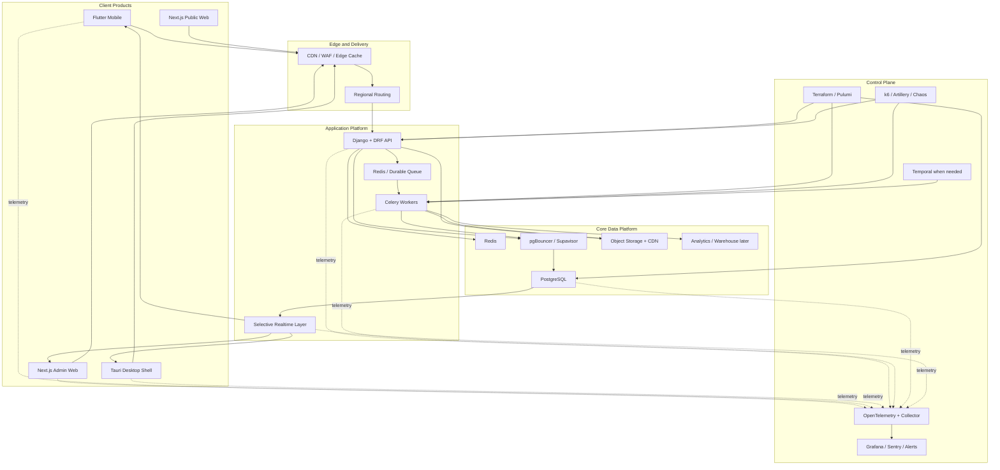

# Business Hub Complete Platform Handbook

## Purpose

This is the single, final, A-to-Z platform handbook for Business Hub.

It is the top-level document that answers:

- what Business Hub should build now
- what technology stack is best
- how mobile, web, desktop, backend, and database should fit together
- how data should be modeled
- how Firebase should migrate to PostgreSQL
- how offline and sync conflicts should be handled
- how the platform should scale
- how operations, observability, recovery, and rollout should work

If one person opens only one architecture document, it should be this one.

If any older architecture note conflicts with this handbook on final stack choice, this handbook is the authoritative version.

## Executive decision

### Final recommended stack

For Business Hub, the best practical architecture is:

- **Flutter** for mobile
- **Next.js** for admin web
- **Next.js** for public web
- **Tauri** only when a packaged desktop shell is needed
- **Python + Django** for the core backend
- **Django REST Framework** for business APIs
- **PostgreSQL** as the source of truth
- **Redis** for cache, hot reads, coordination, and queue support
- **Celery** for background jobs
- **pgBouncer** or **Supavisor** for connection pooling
- **S3-compatible object storage** for files, backups, exports, and receipts
- **OpenTelemetry** for tracing, metrics, and logs
- **Terraform** or **Pulumi** for infrastructure as code
- **k6** for load testing

### Final platform decision

Business Hub should be built in **three tiers**:

### Tier A: Build now

- Flutter
- Next.js
- Django + DRF
- PostgreSQL
- Redis
- Celery
- object storage
- OpenTelemetry
- Terraform/Pulumi

### Tier B: Grow into

- read replicas
- multi-region rollout
- richer projections and caches
- stronger queue topology
- stronger operational control plane
- selective use of Temporal if multi-step workflow durability becomes complex

### Tier C: Keep as future-only

- distributed SQL ledger like Spanner or CockroachDB
- Kafka/PubSub first-hop ledger ingestion
- Go/Rust ultra-high-write ingestion services
- payment-rail-class transaction architecture

### Bottom line

For Business Hub today:

- build **Tier A**
- prepare for **Tier B**
- document **Tier C** as future reference only

## Why this stack is the best fit

Business Hub is much closer to:

- ERP
- POS
- inventory management
- customer and credit tracking
- attendance and team operations
- financial reporting
- ledgers and audit trails

than to:

- social apps
- simple chat apps
- document-only SaaS

That means the best foundation is:

- a strong relational database
- transactional business logic
- typed domain models
- modular backend services
- offline-first mobile behavior

That is why the final recommendation is:

- **Django**
- **PostgreSQL**
- **Flutter**

## Why not stay Firebase-first

Firebase is useful for fast product starts, auth, and selective realtime patterns.

It is not the best long-term source of truth for Business Hub’s heaviest domains because this product needs:

- strongly relational data
- transactional consistency
- ledger-style history
- domain constraints
- predictable reporting
- controlled migration and reconciliation

So Firebase should be treated as:

- the current legacy production backbone
- a bridge source during migration
- not the long-term core transactional database

## Why not build directly on Odoo

Odoo proves that:

- Python is valid for ERP/business systems
- PostgreSQL is valid for ERP/business systems

But Business Hub should not be built *inside* Odoo because Business Hub needs:

- a custom premium UI
- offline-first Flutter POS
- custom mobile behavior
- custom migration path
- custom sync and reconciliation logic

So the best move is:

- follow the **Python + PostgreSQL** direction
- build a **custom Business Hub platform**

## Final platform architecture

## Frontend strategy

### Flutter mobile

Flutter is the primary mobile platform because:

- it avoids WebView lag
- it handles large lists and rich interaction better
- it works well with local SQLite
- it is the right fit for offline-first POS

Mobile rules:

- local SQLite first
- optimistic UI
- background sync
- offline outbox
- stale reconnects handled as command replay, not record overwrite
- offline POS sessions should honor a defined auth grace period, for example up to 12 hours after token expiry, to avoid locking operators out during short outages

### Next.js admin web

Next.js should be the main admin/operator surface for:

- inventory management
- customer management
- reports
- settings
- reconciliation dashboard
- migration review tooling
- team and attendance admin

Why:

- strong route structure
- good code splitting
- clean caching model
- easy reuse in Tauri shell

### Next.js public web

Use a separate public site for:

- landing pages
- onboarding
- pricing
- marketing

It should not share the heavy admin runtime.

### Tauri desktop shell

Use Tauri only where packaged desktop adds value:

- native-feeling desktop delivery
- printing and device integration
- lower memory than heavier desktop wrappers

## Backend strategy

### Final backend choice

Use:

- **Django** for domain models, business logic, admin support, and transactions
- **Django REST Framework** for APIs
- **Celery** for background processing

Why Django:

- strong ORM
- mature admin and business-app patterns
- excellent fit for relational ERP-style systems
- strong modularity for domain-oriented backend design

### Core backend modules

- auth
- users
- shops
- memberships
- permissions
- inventory
- sales
- sale items
- sale payments
- customers
- customer ledger
- expenses
- attendance
- jobs
- imports
- exports
- notifications
- audit
- reports
- reconciliation

### Background job strategy

Use Celery for:

- imports
- exports
- PDF generation
- dashboard rebuilds
- inventory velocity recompute
- customer balance projection refresh
- nightly summaries
- reconciliation jobs
- anomaly detection later if needed

### Realtime strategy

Use realtime only for:

- sale completion state
- stock changes relevant to active sessions
- notifications
- job progress
- presence if needed

Do not make every screen permanently live.

## Data strategy

### PostgreSQL is the long-term source of truth

Use PostgreSQL for:

- users
- shops
- memberships
- inventory
- financial facts
- customer ledger
- expenses
- attendance
- jobs/imports/exports
- audit

### Redis is not the source of truth

Use Redis for:

- hot dashboard reads
- low-stock counts
- rate limiting
- short-lived shop config cache
- idempotency helpers
- websocket/realtime helpers
- queue broker support where appropriate

### Object storage

Use object storage for:

- receipts
- import files
- export files
- reports
- backups
- documents and media

### Connection pooling

Use:

- `pgBouncer`
- or `Supavisor`

between Django/Celery and PostgreSQL.

## Disaster recovery

Tier A should define explicit recovery targets from day one.

Recommended initial targets:

- `RPO` (Recovery Point Objective): maximum 15 minutes of data loss
- `RTO` (Recovery Time Objective): maximum 4 hours to full system restoration

These targets should be revisited as the system moves into Tier B.

## Regional deployment recommendation

For the current operating base:

- primary PostgreSQL and backend API in **Mumbai**
- global CDN/WAF at the edge

This keeps latency low for current operator traffic while still allowing future regional growth.

## Final target data model

### Identity and tenancy

- `users`
- `shops`
- `shop_memberships`
- `membership_permissions`
- `membership_private`
- `devices`

### Inventory

- `inventory_items`
- `inventory_item_private`
- `inventory_stock_ledger`
- `inventory_adjustments`
- `inventory_snapshots`

### Sales and checkout

- `sales`
- `sale_items`
- `sale_payments`
- `sale_discounts`
- `sale_returns`

### Customers and credit

- `customers`
- `customer_ledger_entries`
- `customer_payments`
- `customer_balance_snapshots`

### Team and attendance

- `attendance_sessions`
- `attendance_adjustments`
- `payroll_summary_monthly`

### Expenses and finance

- `expenses`
- `expense_categories`

### Operations

- `jobs`
- `job_events`
- `imports`
- `import_errors`
- `exports`
- `notifications`
- `audit_events`
- `backup_archives`

### Aggregates and projections

- `dashboard_snapshot_current`
- `shop_daily_metrics`
- `shop_monthly_metrics`
- `inventory_low_stock_snapshot`
- `inventory_velocity_snapshot`
- `sales_payment_mix_daily`
- `customer_balance_snapshots`

### Migration support

- `migration_domain_ownership`
- `migration_bridge_events`
- `migration_reconciliation_events`

## Data modeling rules

### Rule 1: preserve source identity

Migrated rows should preserve:

- `source_system`
- `source_id`
- `source_shop_id`
- `source_path`
- `migrated_at`
- `domain_epoch`

### Rule 2: facts over snapshots

Append-only facts remain facts:

- sales
- payments
- stock movements
- customer ledger entries
- audit events

### Rule 3: projections are not canonical

Derived values are not the truth:

- current stock total
- dashboard total
- customer balance
- payment mix

These should be rebuilt from fact tables.

### Rule 4: separate identity from membership

Do not keep all role/tenant logic inside `users`.

Use:

- `users` for identity
- `shop_memberships` for tenancy and role

## Firebase to PostgreSQL migration strategy

### Do not hard cut over

Business Hub should migrate using a **parallel strangler pattern**:

1. schema design
2. snapshot backfill
3. live bridge
4. shadow verification
5. domain cutover
6. Firebase retirement

### Domain ownership rule

For each domain:

- exactly one write master
- the other side is replica/shadow only

Never allow true bidirectional write ownership for the same domain.

### Ownership states

- `firebase_primary`
- `dual_run_bridge_only`
- `postgres_primary`
- `retired`

### Suggested cutover order

1. shop settings
2. inventory
3. customers
4. expenses
5. staff / attendance
6. sales and payments
7. reports / analytics
8. legacy import utilities

### Why sales/payments go late

Because they are:

- financially sensitive
- hardest to reconcile
- most exposed to offline mobile conflict cases

## Live bridge rules

### Unidirectional per domain

Before cutover:

- Firebase writes
- bridge copies Firebase to Postgres

After cutover:

- Postgres writes
- Firebase becomes read-only shadow if needed
- legacy writes are rejected or converted to reconciliation events

### Preventing loops

Every bridged event must carry:

- `origin_system`
- `origin_event_id`
- `bridge_applied_at`
- `bridge_direction`

If an event came from the bridge already, the reverse bridge must ignore it.

## Offline and sync conflict policy

### Core principle

Offline reconnect payloads are **commands**, not **authoritative records**.

The server must interpret reconnects as:

- client attempted action X against base version Y

not:

- overwrite server truth with this old document

### Client outbox fields

- `client_tx_id`
- `device_id`
- `user_id`
- `shop_id`
- `domain`
- `command_type`
- `base_version`
- `base_domain_epoch`
- `client_created_at`
- `payload`

### Required server checks

1. is the device/session valid
2. is the domain still writable by this client generation
3. was this event already applied
4. is the domain epoch stale
5. does the command still make sense against current truth

### Conflict types

#### Type A: mutable reference/config data

Examples:

- product name
- price
- category
- customer profile fields

Policy:

- **server wins**
- stale overwrites rejected
- client must rehydrate and retry

#### Type B: append-only business facts

Examples:

- sale
- payment
- stock movement
- attendance event

Policy:

- validate as append-only command
- accept / reject / review
- never overwrite existing facts

#### Type C: derived counters

Examples:

- stock totals
- dashboard totals
- customer balance snapshots

Policy:

- clients never write these
- recompute from committed facts only

### Domain epoch rule

Each cutover increases a domain epoch.

If a reconnecting client carries an older epoch:

- reject mutable overwrites
- re-evaluate append-only facts under current rules
- send ambiguous cases to reconciliation

### Price drift policy

Price drift must be explicit business policy, such as:

- `strict_current_price`
- `allow_offline_captured_price_with_audit`
- `manual_review_if_price_drift_exceeds_threshold`

## Reconciliation model

### When to use manual review

Use manual review for:

- impossible stock outcomes
- extreme price drift
- duplicate-but-not-identical sales
- stale command against heavily changed entity
- permission mismatches with business impact

### Reconciliation queue fields

- `domain`
- `shop_id`
- `client_tx_id`
- `device_id`
- `reason`
- `severity`
- `payload_json`
- `server_snapshot_json`
- `status`
- `resolved_by`
- `resolved_at`
- `created_at`

### Product implication

You need a secure admin review UI for:

- approve
- reject
- annotate
- replay if safe

## Shadow verification rules

Never cut over a sensitive domain without green shadow verification.

### Inventory verification

- item count
- active item count
- low-stock count
- price parity
- cost parity

### Customer verification

- customer count
- open-balance total
- sample balance parity

### Sales/payment verification

- sales count by day
- gross sales by day
- payment totals by method
- refund/void counts

### Attendance verification

- session count
- total hours
- active shift status

### If mismatches appear

1. stop cutover
2. inspect mismatch dashboard
3. identify missing or duplicated IDs
4. determine whether issue is:
   - backfill miss
   - bridge lag
   - duplicate suppression bug
   - rejected stale replay

## Operational scenarios

### Scenario 1: owner signs in during migration

- auth signs in the user
- backend resolves membership from Postgres
- if missing, recover from Firebase-era membership data
- auth and data migration remain decoupled

### Scenario 2: inventory before cutover

- Firebase is master
- Postgres is replica
- new services do not authoritatively write inventory

### Scenario 3: inventory after cutover

- Postgres is master
- Firebase is optional read-only shadow
- legacy writes are blocked or converted to review events

### Scenario 4: offline mobile sale reconnect

- mobile replays sale command
- server validates
- if valid, commits sale, items, payments, stock ledger
- if ambiguous, creates reconciliation event

### Scenario 5: stale mutable inventory write

- old snapshot returns from offline device
- server rejects overwrite
- server returns authoritative current item
- client refreshes

### Scenario 6: mismatch dashboard turns red

- cutover pauses
- team investigates
- no financially sensitive cutover proceeds while red

### Scenario 7: rollback

- feature flag routes shop/domain back to prior owner
- bridge direction freezes
- events remain preserved
- diagnosis happens without losing audit trail

### Scenario 8: final Firebase retirement

- all major domains are Postgres-primary
- legacy writes disabled
- bridge retired gradually
- Firebase becomes archive/read-only temporarily if needed

## Scale strategy

### Tier A scale

Build now with:

- PostgreSQL primary
- Redis
- Celery
- Django
- Flutter
- Next.js
- CDN/WAF
- OpenTelemetry

This is enough for real production and strong growth.

### Tier B scale

Add when justified:

- read replicas
- richer projections
- stronger caching
- stronger queues
- regional scaling
- stronger chaos/load testing

### Tier C scale

Only if Business Hub becomes globally write-heavy at financial-network class:

- distributed SQL ledger
- Kafka/PubSub first-hop
- Go/Rust ingestion plane
- commit pipeline
- heavy workflow orchestration

## Production control plane

### Must-have now

- OpenTelemetry traces, metrics, logs
- structured JSON logging
- Terraform/Pulumi
- k6 load testing
- client event batching and virtualization

### Add later if complexity demands

- Temporal
- richer anomaly detection
- stronger FinOps controls
- advanced chaos engineering

## Build phases

### Phase 1

- PostgreSQL schema
- Django app/module structure
- DRF API foundations
- Flutter local SQLite foundations
- Next.js admin shell
- Redis foundation
- OpenTelemetry
- Terraform/Pulumi

### Phase 2

- backfill Firebase to Postgres
- domain ownership service
- bridge
- shadow verification
- projection tables

### Phase 3

- pilot domain cutovers
- reconciliation dashboard
- legacy client compatibility policy
- rollback drills

### Phase 4

- broader cutovers
- stronger queue/workers
- read replicas if needed
- regional scaling if needed

### Phase 5

- retire Firebase dependencies
- remove legacy compatibility paths

## What not to do

- do not keep expanding heavy core domains deeper into Firebase-first direct-client flows
- do not use last-write-wins for financial or inventory migration conflicts
- do not let clients write derived totals as truth
- do not make every screen permanently realtime
- do not jump to distributed SQL before Postgres is actually proven insufficient
- do not skip observability, IaC, or load testing

## Final verdict

The final recommended Business Hub platform is:

- **Flutter + Next.js + Tauri on the frontend**
- **Django + DRF + PostgreSQL + Redis + Celery in the core platform**
- **OpenTelemetry + IaC + load testing in the control plane**
- **Firebase-to-Postgres migration using a domain-by-domain strangler pattern**
- **command-based offline reconciliation**
- **one write master per domain**
- **append-only financial facts**
- **manual review for ambiguous conflicts**
- **Tier A now, Tier B later, Tier C only if the business truly reaches that scale**

This is the final, single-file platform plan for Business Hub.

## Detailed companion docs

For deeper detail, see:

- [Final Architecture Blueprint](./final-architecture-blueprint.md)
- [Firebase to PostgreSQL Migration Plan](./firebase-to-postgres-migration-plan.md)
- [Firebase to PostgreSQL Schema Map](./firebase-to-postgres-schema-map.md)
- [Platform Scenarios and Operational Flows](./platform-scenarios-and-operational-flows.md)
- [Target Platform Architecture](./target-platform-architecture.md)
- [High-Scale Global Architecture](./high-scale-global-architecture.md)
- [Ultra-High-Write Transaction Architecture](./ultra-high-write-transaction-architecture.md)
- [Production Control Plane Architecture](./production-control-plane-architecture.md)
