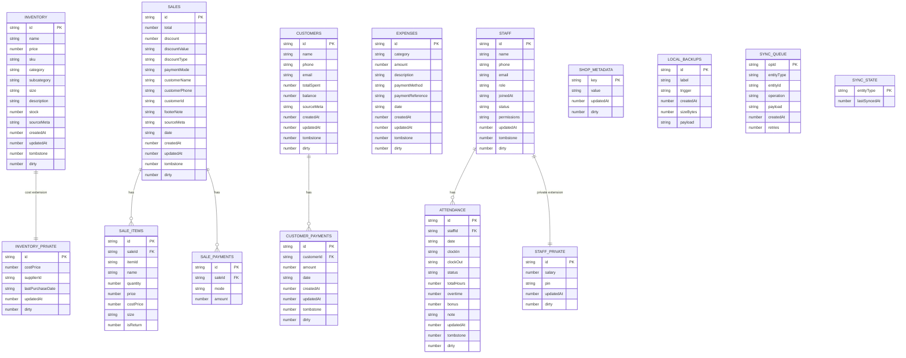
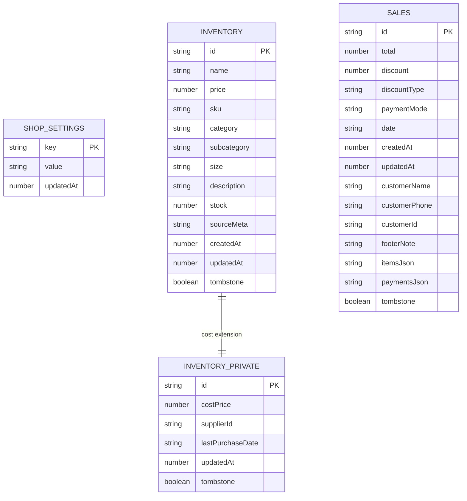

# Business Hub Data Model and ERD

## Scope

This document describes the current Business Hub data model across:
- Cloud Firestore
- legacy web/admin local SQLite
- Flutter mobile local SQLite

It is intentionally explicit about where the schemas differ.

## 1. Cloud Firestore ERD

Business Hub uses a shop-scoped Firestore hierarchy.

```mermaid
erDiagram
  USERS {
    string userId PK
    string email
    string shopId
    string role
    string updatedAt
  }

  SHOPS {
    string shopId PK
    string ownerId
    string name
    map settings
    string inviteCode
    string createdAt
  }

  STAFF {
    string id PK
    string role
    string status
    string email
    string phone
    map permissions
    number updatedAt
  }

  STAFF_PRIVATE {
    string id PK
    number salary
    string pin
    number updatedAt
  }

  INVENTORY {
    string id PK
    string name
    number price
    string sku
    string category
    string subcategory
    string size
    number stock
    any sourceMeta
    any createdAt
    any updatedAt
    boolean tombstone
  }

  INVENTORY_PRIVATE {
    string id PK
    number costPrice
    string supplierId
    string lastPurchaseDate
    any updatedAt
    boolean tombstone
  }

  SALES {
    string id PK
    number total
    number discount
    string discountType
    string paymentMode
    string customerName
    string customerPhone
    string customerId
    string footerNote
    string date
    any createdAt
    any updatedAt
    string staffId
    boolean tombstone
  }

  CUSTOMERS {
    string id PK
    string name
    string phone
    string email
    number totalSpent
    number balance
    any createdAt
    any updatedAt
    boolean tombstone
  }

  EXPENSES {
    string id PK
    string category
    number amount
    string description
    string paymentMethod
    string paymentReference
    string date
    any createdAt
    any updatedAt
    boolean tombstone
  }

  ATTENDANCE {
    string id PK
    string staffId
    string date
    string clockIn
    string clockOut
    string status
    number totalHours
    number overtime
    number bonus
    string note
    any updatedAt
    boolean tombstone
  }

  INVITATIONS {
    string id PK
    string createdAt
  }

  JOBS {
    string id PK
    string type
    string status
    number createdAt
  }

  IMPORTS {
    string id PK
    string type
    string status
    number createdAt
  }

  BACKUP_ARCHIVES {
    string id PK
    string createdAt
  }

  DASHBOARD_SNAPSHOT {
    string id PK
  }

  AGGREGATES_DAILY {
    string id PK
  }

  CUSTOMER_CREDIT_SUMMARY {
    string id PK
  }

  STAFF_PAYROLL_SUMMARY {
    string id PK
  }

  USERS ||--o{ SHOPS : "owner via ownerId"
  SHOPS ||--o{ STAFF : contains
  SHOPS ||--o{ STAFF_PRIVATE : contains
  SHOPS ||--o{ INVENTORY : contains
  SHOPS ||--o{ INVENTORY_PRIVATE : contains
  SHOPS ||--o{ SALES : contains
  SHOPS ||--o{ CUSTOMERS : contains
  SHOPS ||--o{ EXPENSES : contains
  SHOPS ||--o{ ATTENDANCE : contains
  SHOPS ||--o{ INVITATIONS : contains
  SHOPS ||--o{ JOBS : contains
  SHOPS ||--o{ IMPORTS : contains
  SHOPS ||--o{ BACKUP_ARCHIVES : contains
  SHOPS ||--o{ DASHBOARD_SNAPSHOT : contains
  SHOPS ||--o{ AGGREGATES_DAILY : contains
  SHOPS ||--o{ CUSTOMER_CREDIT_SUMMARY : contains
  SHOPS ||--o{ STAFF_PAYROLL_SUMMARY : contains
```

## 2. Legacy web/admin local SQLite ERD

The current web/admin app has the richest local schema.

## 3. Flutter mobile local SQLite ERD

The Flutter app currently uses a smaller performance-first schema.

## 4. Cloud-to-local coverage map

| Domain | Firestore | Web local SQLite | Flutter local SQLite |
|---|---|---:|---:|
| Shop settings | Yes | Yes | Yes |
| Inventory | Yes | Yes | Yes |
| Inventory private | Yes | Yes | Yes |
| Sales | Yes | Yes | Yes |
| Sale items normalized | Implicit in sale payload | Yes | No |
| Sale payments normalized | Implicit in sale payload | Yes | No |
| Customers | Yes | Yes | No |
| Customer payments | Yes | Yes | No |
| Expenses | Yes | Yes | No |
| Staff | Yes | Yes | No |
| Staff private | Yes | Yes | No |
| Attendance | Yes | Yes | No |
| Sync outbox | Client-specific | Yes | No dedicated outbox yet |
| Sync watermark | Client-specific | Yes | No dedicated watermark table yet |

## 5. Important architectural meaning

### Why web can show more data than Flutter

The old web/admin app:
- stores more entity types locally
- has a richer normalized local schema
- includes a durable outbox and sync-state model

The Flutter app today:
- intentionally syncs only the performance-critical subset
- focuses on shop metadata, inventory, inventory cost data, and sales

So:
- if a feature depends on customers, attendance, or staff local cache, the web app can currently do more
- if data was present only in old web local storage and never shared to Firestore, Flutter cannot see it

### Why Flutter still feels better for future mobile performance

The Flutter model is smaller by design:
- less startup load
- less schema overhead
- native SQLite access
- easier screen-specific tuning

This is good for performance, but not yet enough for total feature parity.

## 6. Recommended next schema expansions for Flutter

To move Flutter closer to full replacement status, the next local tables should be:

1. `customers`
2. `customer_payments`
3. `expenses`
4. `staff`
5. `attendance`
6. dedicated mobile `sync_queue`
7. dedicated mobile `sync_state`

## 7. Summary

The Business Hub data model is currently **three-layered**:

1. **Cloud Firestore**
   - shared cross-device business truth
2. **Legacy web/admin local SQLite**
   - broad operational local-first model
3. **Flutter mobile local SQLite**
   - narrow performance-first model

That split is the key fact to understand when debugging parity, sync behavior, and "why does one client show more than another?"
