# All Diagrams

This file embeds every Mermaid diagram extracted from the Business Hub docs pack.

## system context

Source group: `architecture overview`

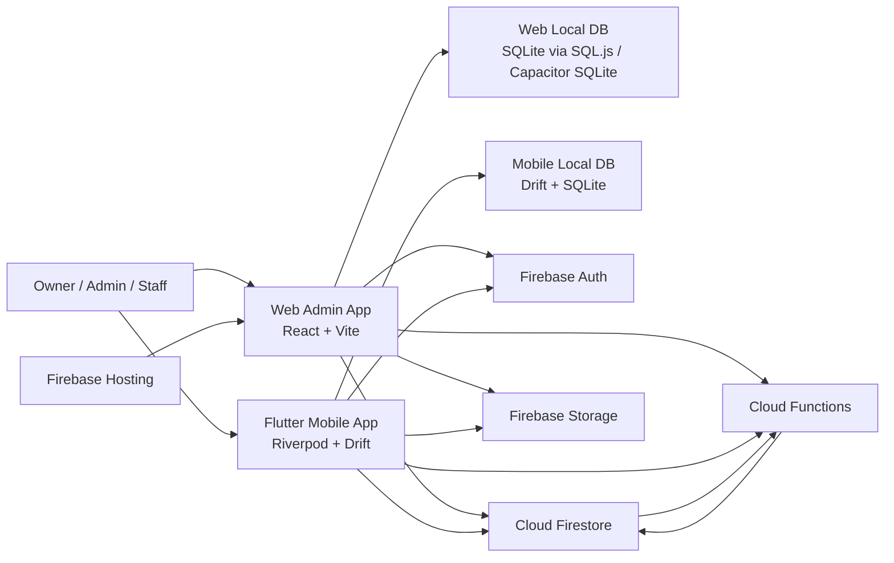

## web admin runtime

Source group: `architecture overview`

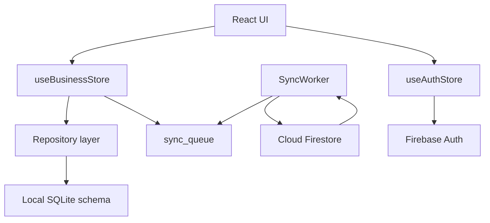

## flutter mobile runtime

Source group: `architecture overview`

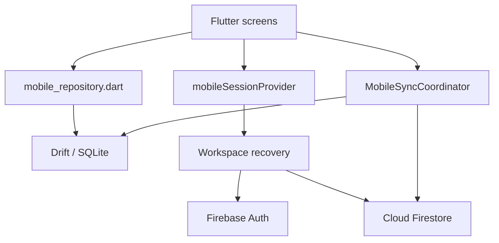

## web sync path

Source group: `architecture overview`

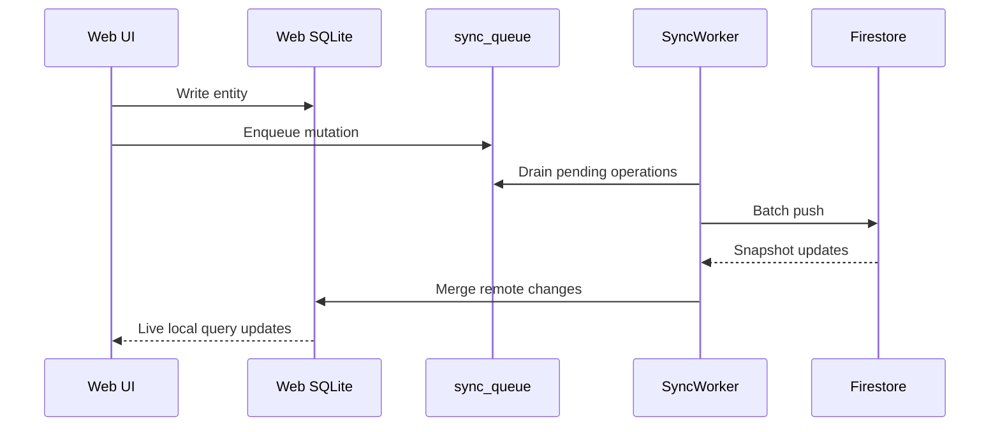

## flutter mobile sync path

Source group: `architecture overview`

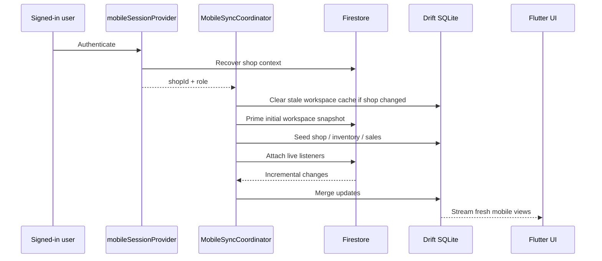

## deployment view

Source group: `architecture overview`

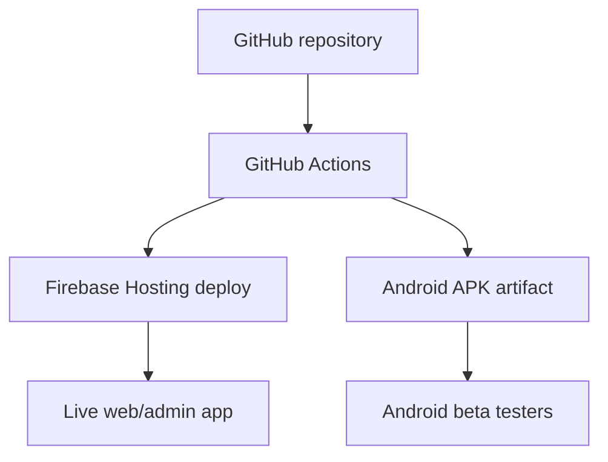

## final platform architecture

Source group: `business hub complete platform handbook`

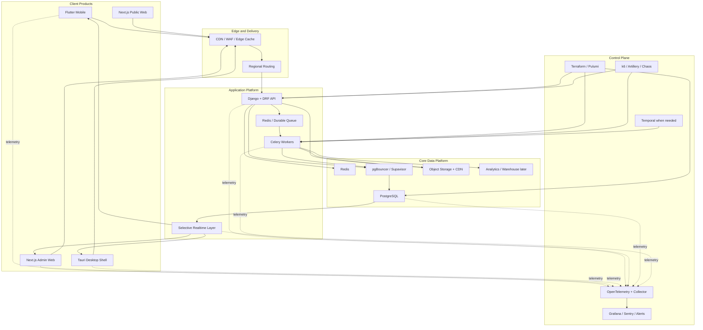

## 1 cloud firestore erd

Source group: `data model erd`

```mermaid
erDiagram
  USERS {
    string userId PK
    string email
    string shopId
    string role
    string updatedAt
  }

  SHOPS {
    string shopId PK
    string ownerId
    string name
    map settings
    string inviteCode
    string createdAt
  }

  STAFF {
    string id PK
    string role
    string status
    string email
    string phone
    map permissions
    number updatedAt
  }

  STAFF_PRIVATE {
    string id PK
    number salary
    string pin
    number updatedAt
  }

  INVENTORY {
    string id PK
    string name
    number price
    string sku
    string category
    string subcategory
    string size
    number stock
    any sourceMeta
    any createdAt
    any updatedAt
    boolean tombstone
  }

  INVENTORY_PRIVATE {
    string id PK
    number costPrice
    string supplierId
    string lastPurchaseDate
    any updatedAt
    boolean tombstone
  }

  SALES {
    string id PK
    number total
    number discount
    string discountType
    string paymentMode
    string customerName
    string customerPhone
    string customerId
    string footerNote
    string date
    any createdAt
    any updatedAt
    string staffId
    boolean tombstone
  }

  CUSTOMERS {
    string id PK
    string name
    string phone
    string email
    number totalSpent
    number balance
    any createdAt
    any updatedAt
    boolean tombstone
  }

  EXPENSES {
    string id PK
    string category
    number amount
    string description
    string paymentMethod
    string paymentReference
    string date
    any createdAt
    any updatedAt
    boolean tombstone
  }

  ATTENDANCE {
    string id PK
    string staffId
    string date
    string clockIn
    string clockOut
    string status
    number totalHours
    number overtime
    number bonus
    string note
    any updatedAt
    boolean tombstone
  }

  INVITATIONS {
    string id PK
    string createdAt
  }

  JOBS {
    string id PK
    string type
    string status
    number createdAt
  }

  IMPORTS {
    string id PK
    string type
    string status
    number createdAt
  }

  BACKUP_ARCHIVES {
    string id PK
    string createdAt
  }

  DASHBOARD_SNAPSHOT {
    string id PK
  }

  AGGREGATES_DAILY {
    string id PK
  }

  CUSTOMER_CREDIT_SUMMARY {
    string id PK
  }

  STAFF_PAYROLL_SUMMARY {
    string id PK
  }

  USERS ||--o{ SHOPS : "owner via ownerId"
  SHOPS ||--o{ STAFF : contains
  SHOPS ||--o{ STAFF_PRIVATE : contains
  SHOPS ||--o{ INVENTORY : contains
  SHOPS ||--o{ INVENTORY_PRIVATE : contains
  SHOPS ||--o{ SALES : contains
  SHOPS ||--o{ CUSTOMERS : contains
  SHOPS ||--o{ EXPENSES : contains
  SHOPS ||--o{ ATTENDANCE : contains
  SHOPS ||--o{ INVITATIONS : contains
  SHOPS ||--o{ JOBS : contains
  SHOPS ||--o{ IMPORTS : contains
  SHOPS ||--o{ BACKUP_ARCHIVES : contains
  SHOPS ||--o{ DASHBOARD_SNAPSHOT : contains
  SHOPS ||--o{ AGGREGATES_DAILY : contains
  SHOPS ||--o{ CUSTOMER_CREDIT_SUMMARY : contains
  SHOPS ||--o{ STAFF_PAYROLL_SUMMARY : contains
```

## 2 legacy web admin local sqlite erd

Source group: `data model erd`

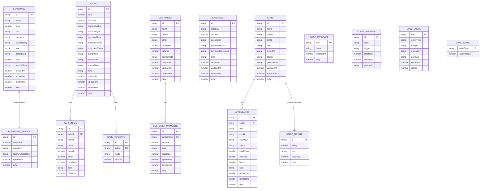

## 3 flutter mobile local sqlite erd

Source group: `data model erd`

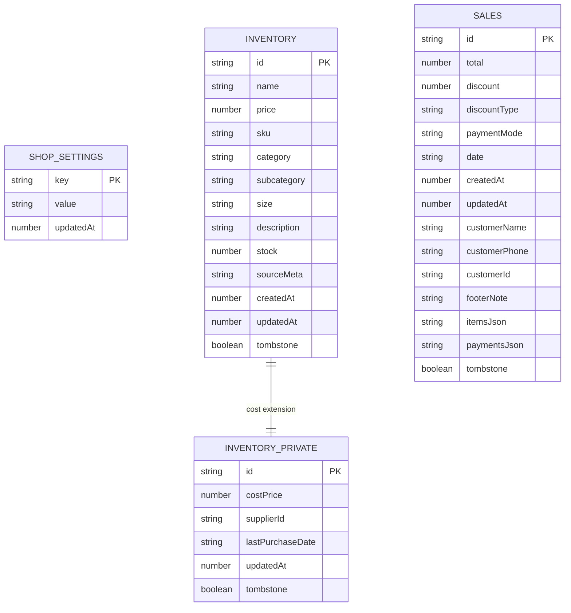

## final architecture in one view

Source group: `final architecture blueprint`

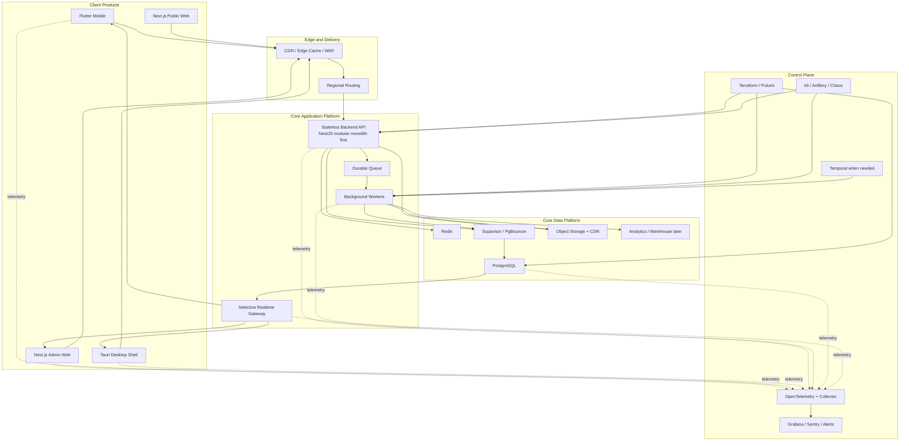

## migration model

Source group: `firebase to postgres migration plan`

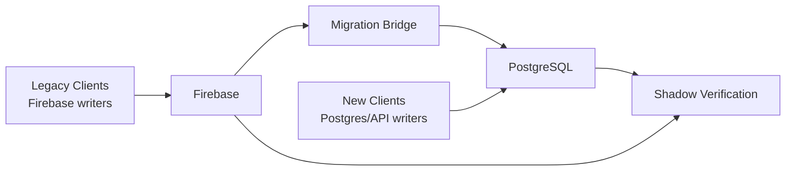

## core relational model

Source group: `firebase to postgres schema map`

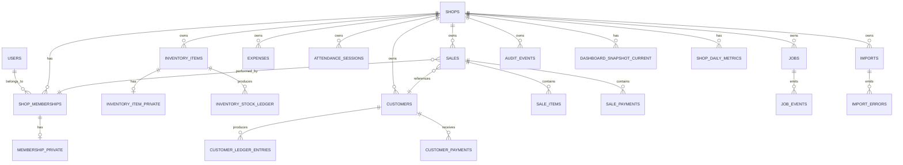

## recommended global target architecture

Source group: `high scale global architecture`

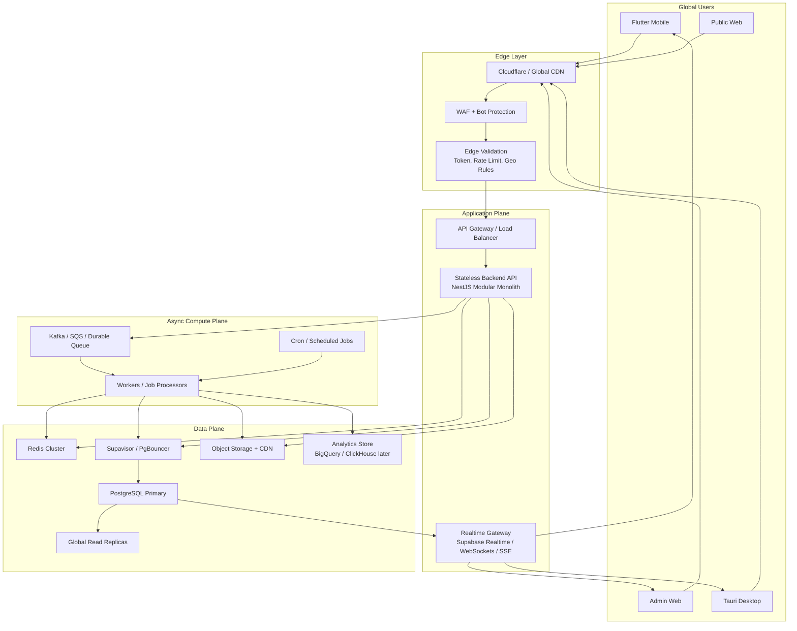

## best in class request flow

Source group: `high scale global architecture`

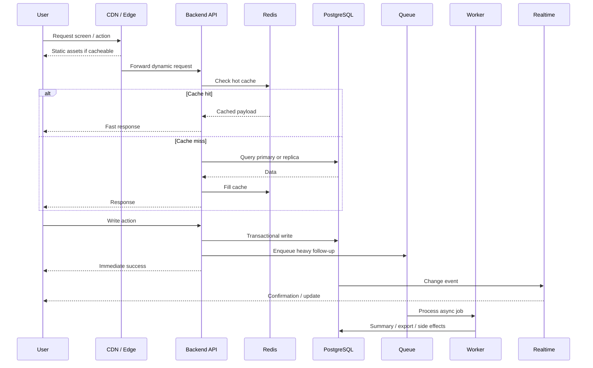

## owner sign in

Source group: `platform scenarios and operational flows`

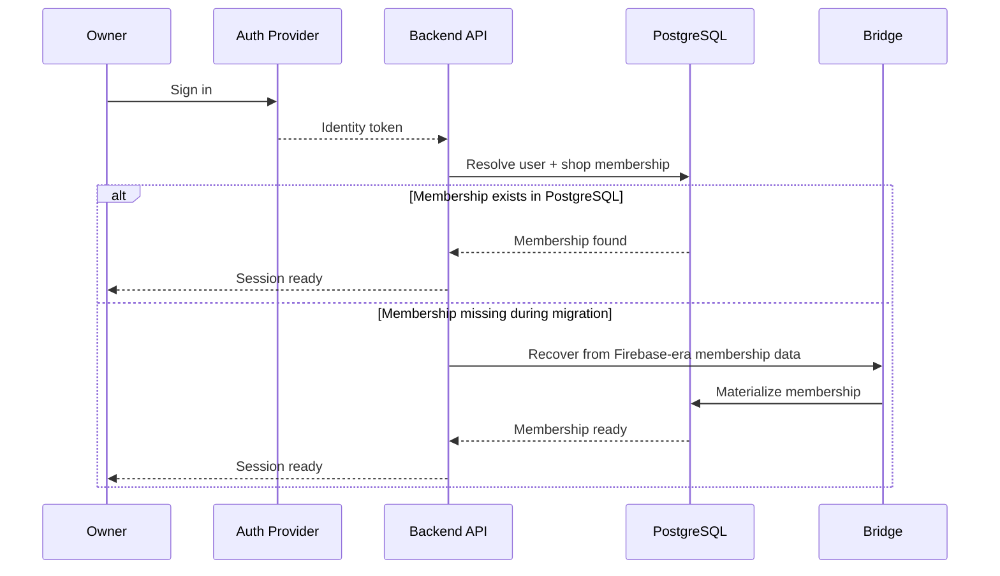

## offline sale reconnect

Source group: `platform scenarios and operational flows`

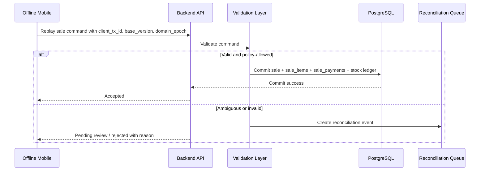

## reconciliation review

Source group: `platform scenarios and operational flows`

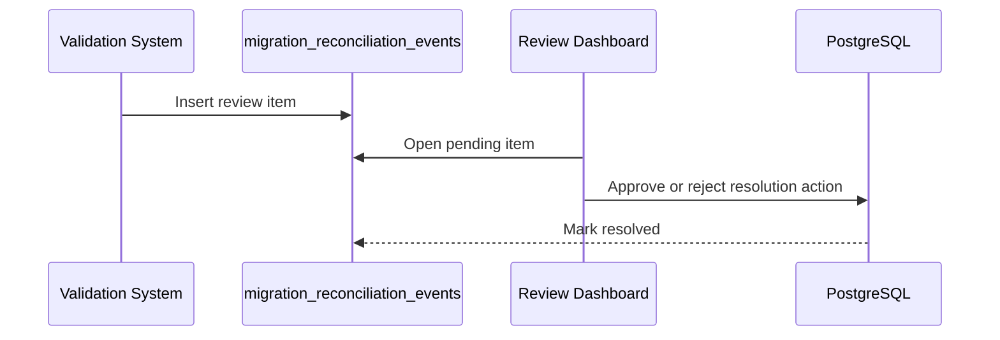

## what this control plane protects

Source group: `production control plane architecture`

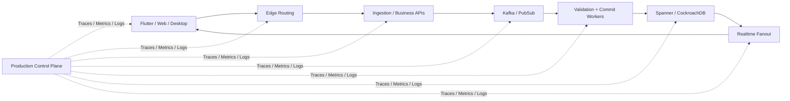

## required trace path

Source group: `production control plane architecture`

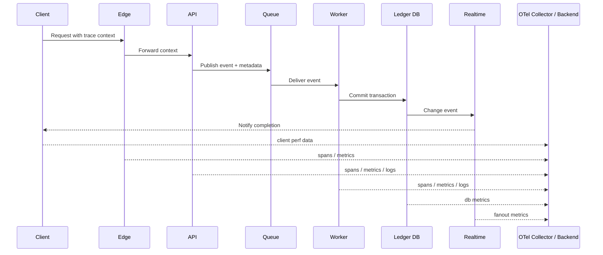

## example workflow stages

Source group: `production control plane architecture`

```mermaid
stateDiagram-v2
  [*] --> Accepted
  Accepted --> SchemaValidated
  SchemaValidated --> AuthValidated
  AuthValidated --> IdempotencyChecked
  IdempotencyChecked --> BusinessRuleValidated
  BusinessRuleValidated --> StockValidated
  StockValidated --> LedgerCommitted
  LedgerCommitted --> ProjectionsUpdated
  ProjectionsUpdated --> FanoutDelivered
  FanoutDelivered --> [*]

  SchemaValidated --> Rejected
  AuthValidated --> Rejected
  IdempotencyChecked --> Rejected
  BusinessRuleValidated --> Rejected
  StockValidated --> Rejected
  Rejected --> [*]
```

## 10 recommended deployment control architecture

Source group: `production control plane architecture`

```mermaid
flowchart TD
  subgraph Runtime["Runtime System"]
    Clients["Clients"]
    Edge["Edge + WAF"]
    APIs["APIs"]
    Stream["Queue / Stream"]
    Workflows["Temporal Workflows"]
    Workers["Workers"]
    DB["Ledger DB"]
    Fanout["Realtime"]
  end

  subgraph Control["Control Plane"]
    OTel["OpenTelemetry + Collector"]
    Dash["Grafana / Sentry / Alerting"]
    IaC["Terraform / Pulumi"]
    CI["CI/CD + Policy Gates"]
    Test["k6 / Artillery / Chaos Tests"]
    Sec["Secrets + Identity"]
  end

  Clients --> Edge --> APIs --> Stream --> Workflows --> Workers --> DB --> Fanout

  Clients -. telemetry .-> OTel
  Edge -. telemetry .-> OTel
  APIs -. telemetry .-> OTel
  Stream -. telemetry .-> OTel
  Workflows -. telemetry .-> OTel
  Workers -. telemetry .-> OTel
  DB -. telemetry .-> OTel
  Fanout -. telemetry .-> OTel

  OTel --> Dash
  IaC --> CI
  CI --> Runtime
  Test --> Runtime
  Sec --> Runtime
```

## target system map

Source group: `target platform architecture`

```mermaid
flowchart LR
  subgraph Clients["Client Layer"]
    Mobile["Flutter Mobile App"]
    AdminWeb["Next.js Admin Web"]
    PublicWeb["Next.js Public Web"]
    Desktop["Tauri 2 Desktop Shell"]
  end

  subgraph Edge["Edge and Delivery"]
    CDN["CDN / Edge Cache"]
    LB["Load Balancer / API Gateway"]
  end

  subgraph App["Application Layer"]
    API["Stateless Backend API\nNestJS or Fastify"]
    Realtime["Realtime Gateway\nSupabase Realtime / WS / SSE"]
    Workers["Background Workers"]
  end

  subgraph Data["Data Layer"]
    Redis["Redis Cache"]
    Postgres["PostgreSQL"]
    Pooler["Connection Pooler\nSupavisor / PgBouncer"]
    Storage["Object Storage + CDN"]
  end

  Mobile --> CDN
  AdminWeb --> CDN
  PublicWeb --> CDN
  Desktop --> CDN

  Mobile --> LB
  AdminWeb --> LB
  PublicWeb --> LB
  Desktop --> LB

  LB --> API
  API --> Redis
  API --> Pooler
  Pooler --> Postgres
  API --> Storage
  API --> Workers
  Workers --> Pooler
  Workers --> Redis
  Workers --> Storage
  Postgres --> Realtime
  Realtime --> Mobile
  Realtime --> AdminWeb
  Realtime --> Desktop
```

## mobile data flow

Source group: `target platform architecture`

```mermaid
sequenceDiagram
  participant UI as Flutter UI
  participant Local as SQLite / Drift
  participant Outbox as Local Outbox
  participant API as Backend API
  participant Jobs as Workers
  participant DB as PostgreSQL
  participant RT as Realtime

  UI->>Local: Write immediately
  UI->>Outbox: Queue mutation
  Local-->>UI: Update screen instantly
  Outbox->>API: Sync mutation
  API->>DB: Transactional write
  API-->>Outbox: Ack / version
  DB->>RT: Change event
  RT-->>UI: Confirmation / refresh signal
  API->>Jobs: Heavy work if needed
  Jobs->>DB: Background updates
  DB->>RT: Job completion events
```

## core idea

Source group: `ultra high write transaction architecture`

```mermaid
flowchart LR
  Client["Flutter / Web / Desktop Client"]
  Edge["Global Edge / Regional Routing"]
  Ingest["Ultra-fast Ingestion API"]
  Stream["Durable Event Stream\nKafka or Pub/Sub"]
  Validate["Validation Workers"]
  Ledger["Distributed SQL Ledger\nSpanner or CockroachDB"]
  Fanout["Realtime Fanout Layer"]
  ReadModel["Read Models / Cache / Projections"]

  Client --> Edge
  Edge --> Ingest
  Ingest --> Stream
  Stream --> Validate
  Validate --> Ledger
  Ledger --> Fanout
  Ledger --> ReadModel
  Fanout --> Client
  ReadModel --> Client
```

## global target architecture

Source group: `ultra high write transaction architecture`

```mermaid
flowchart TD
  subgraph Clients["Client Layer"]
    Mobile["Flutter Mobile"]
    Web["Next.js Admin / Public Web"]
    Desktop["Tauri Desktop"]
  end

  subgraph Edge["Global Edge Plane"]
    CDN["Cloudflare / Global CDN"]
    WAF["WAF + Bot Protection"]
    Router["Regional Routing + Rate Limiting"]
    EdgeAuth["Edge Token Screening"]
  end

  subgraph Ingestion["Write Ingestion Plane"]
    IngestAPI["Go or Rust Ingestion API"]
    Idempotency["Idempotency / Replay Guard"]
    OutboxAck["Fast Ack Service"]
  end

  subgraph Stream["Streaming Plane"]
    Topic["Kafka / Pub/Sub Transaction Topics"]
    DLQ["Dead Letter / Retry Topics"]
  end

  subgraph Validation["Validation and Commit Plane"]
    Validator["Validation Workers"]
    RuleEngine["Business Rules / Risk / Limits"]
    Committer["Ledger Commit Workers"]
  end

  subgraph Data["Core Data Plane"]
    Ledger["Distributed SQL Ledger\nSpanner or CockroachDB"]
    Redis["Redis / Cache / Fanout Assist"]
    Storage["Object Storage"]
    Analytics["Warehouse / OLAP"]
  end

  subgraph Realtime["Realtime Plane"]
    Notify["Realtime Fanout / WS / SSE"]
  end

  Mobile --> CDN
  Web --> CDN
  Desktop --> CDN

  CDN --> WAF
  WAF --> Router
  Router --> EdgeAuth
  EdgeAuth --> IngestAPI

  IngestAPI --> Idempotency
  Idempotency --> Topic
  IngestAPI --> OutboxAck
  OutboxAck --> Mobile
  OutboxAck --> Web
  OutboxAck --> Desktop

  Topic --> Validator
  Validator --> RuleEngine
  RuleEngine --> Committer
  Committer --> Ledger
  Validator --> DLQ

  Ledger --> Redis
  Ledger --> Analytics
  Ledger --> Notify
  Notify --> Mobile
  Notify --> Web
  Notify --> Desktop
```

