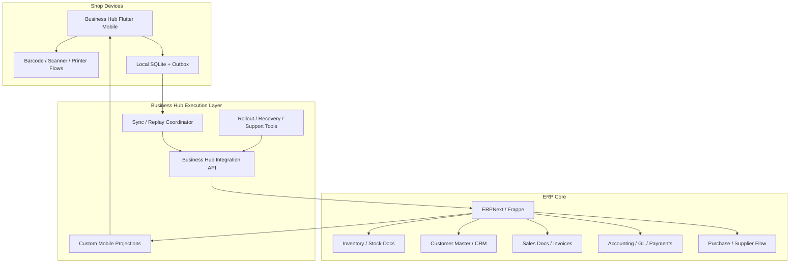

# ERPNext-Backed Target Architecture For Business Hub

## Purpose

This document defines the recommended target architecture if Business Hub adopts ERPNext.

It assumes the fit-gap analysis result is accepted:

- ERPNext becomes the business backbone
- Business Hub keeps the custom Flutter execution layer
- integration is explicit and domain-owned

## Core decision

Business Hub should adopt a **hybrid ERP architecture**:

- **ERPNext / Frappe** becomes the authoritative ERP and back-office system
- **Business Hub Flutter** remains the primary mobile execution surface
- **Business Hub custom services** remain where offline execution, replay, and device UX require them

## Architecture in one view

## Ownership boundaries

## Business Hub owns

- Flutter mobile UI
- local SQLite cache
- device-side outbox
- offline replay policy
- cashier ergonomics
- scanner and receipt flow
- queue health UX
- support and recovery UX
- rollout and migration operator tooling

## ERPNext owns

- accounting truth
- supplier and purchase workflows
- item and customer master records
- warehouse and stock document logic
- back-office approvals and process records
- standard ERP reporting baseline

## Shared boundary

The following must be integrated but have single ownership:

### Sales posting

- Business Hub can originate a sale command
- ERPNext should own the final ERP-side sales document

### Payment posting

- Business Hub can originate cashier-side payment capture
- ERPNext should own the final accounting/payment posting

### Customer balances

- Business Hub may display balance fast from projections
- ERPNext should own the final balance-driving records

### Inventory availability

- Business Hub may cache availability
- ERPNext should own final stock transactions

## Recommended data flow

## 1. Product and customer masters

- ERPNext owns creation and edits
- Business Hub imports them into local mobile projections
- devices read these locally for speed

## 2. Sale execution

- cashier performs sale in Flutter
- sale is saved locally first
- outbox replays the command to Business Hub integration API
- integration API creates or posts the ERPNext-side transaction
- accepted result updates local status and projections

## 3. Payment execution

- payment is captured in Flutter
- Business Hub replay layer posts the payment event
- ERPNext records the payment-side business transaction
- returned success updates local receipt state

## 4. Stock impact

- ERPNext applies authoritative stock logic
- resulting stock changes flow back into Business Hub projections
- mobile catalog refreshes from those projections

## Recommended integration strategy

## Option 1: Direct mobile to ERPNext

Not recommended as the default.

### Why

- makes offline recovery harder
- couples the device tightly to ERPNext document rules
- makes small-screen product logic harder to evolve independently

## Option 2: Business Hub integration layer in front of ERPNext

Recommended.

### Why

- preserves local-first architecture
- lets Business Hub keep command replay discipline
- allows ERPNext mapping and adaptation in one controlled place
- makes rollback and support easier

## Suggested integration endpoints

Business Hub should expose stable integration-facing commands such as:

- `POST /sales/commands`
- `POST /payments/commands`
- `GET /catalog/snapshot`
- `GET /customers/snapshot`
- `GET /domain-state`

Under the hood, those commands can map into ERPNext/Frappe operations.

## Projection strategy

Do not make the Flutter app wait on ERPNext for every screen.

Use projection tables or cached snapshots for:

- product catalog
- customer summaries
- last balances
- recent receipts
- stock status

This preserves the speed profile of Business Hub even if ERPNext remains the business backbone.

## Security model

Recommended model:

- ERPNext handles authoritative users, roles, and permissions for ERP concerns
- Business Hub maps ERP roles into mobile-facing capabilities
- mobile tokens should not expose unnecessary ERP internals directly to the device

## Reporting model

### Use ERPNext for

- accounting reports
- purchase reports
- stock valuation and standard ERP reporting

### Use Business Hub custom reporting for

- mobile operator insights
- rollout and sync health
- device-level support diagnostics
- highly tuned owner dashboards if ERPNext UX is too slow or dense

## What should not be rebuilt

Do **not** rebuild these only because ERPNext exists:

- Flutter POS UX
- mobile outbox and replay
- support and recovery UX
- device evidence tooling
- scanner-first cashier flows

These are expensive to rebuild and are part of Business Hub's practical product advantage.

## Migration path

Recommended order if ERPNext adoption is approved:

1. customer and item master sync
2. inventory / warehouse / stock document integration
3. purchase and supplier process adoption
4. accounting adoption
5. sales and payments document integration from custom POS
6. selective retirement of old custom back-office modules

## Anti-patterns to avoid

- letting both ERPNext and Business Hub edit the same domain directly
- putting ERPNext forms directly in front of cashier-critical flows
- removing local SQLite execution just to "simplify"
- rebuilding every UI in Frappe before proving fit
- mixing ERP master ownership and device-side edits without reconciliation rules

## Final recommendation

If Business Hub moves forward with ERPNext, the target architecture should be:

- **ERPNext for system-of-record ERP**
- **Business Hub for execution-speed mobile product**
- **a clean integration layer between them**

That path gives the team the most leverage with the least UX sacrifice.

## Reference links

- [ERPNext Homepage](https://erpnext.com/homepage)
- [ERPNext Documentation](https://docs.erpnext.com/)
- [ERPNext GitHub Repository](https://github.com/frappe/erpnext)
