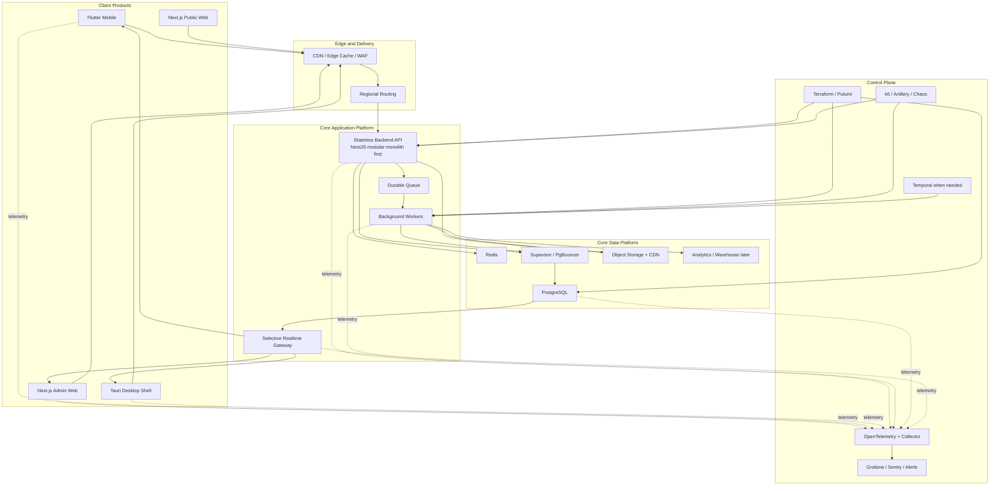

# Business Hub Final Architecture Blueprint

## Purpose

This is the final top-level architecture document for Business Hub.

It combines the conclusions from the detailed architecture docs into one decision-oriented blueprint that answers:

- what Business Hub should build **now**
- what it should evolve into at **enterprise scale**
- what belongs only in the **ultra-high-write future**

This document is meant to be the single best starting point for product, engineering, and leadership decisions.

## Executive decision

### Final recommendation for Business Hub

Business Hub should be built in **three architectural tiers**:

1. **Tier A: Build now**
   - PostgreSQL-first
   - Flutter mobile
   - Next.js admin web
   - Next.js public web
   - Tauri desktop shell
   - one backend API
   - Redis
   - workers
   - selective realtime
   - strong observability and IaC from day one

2. **Tier B: Grow into**
   - multi-region deployment
   - read replicas
   - stronger queueing
   - richer caching
   - projection-heavy dashboards
   - stricter control plane and chaos testing

3. **Tier C: Keep as future-only**
   - distributed SQL ledger
   - stream-first ingestion
   - Go/Rust ultra-fast write ingress
   - Kafka/PubSub-ledger commit pipeline
   - Temporal-heavy validation orchestration

### Bottom line

For Business Hub today:

- **Tier A is the right architecture**
- **Tier B is the right scale path**
- **Tier C is the right future reference, not the right current build target**

## Final architecture in one view

## The three-tier strategy

### Tier A: Business Hub build-now architecture

This is the architecture I recommend actually building and deploying as the main product direction.

### Frontends

- Flutter mobile for the primary app experience
- Next.js admin web for business operations
- Next.js public web for landing / onboarding / marketing
- Tauri desktop shell only where packaged desktop is needed

### Backend

- NestJS modular monolith first
- one shared API for all core business logic
- workers for imports, exports, summaries, reports, and heavy jobs

### Data layer

- PostgreSQL as the source of truth
- Redis for hot cache and coordination
- object storage for files
- connection pooling in front of Postgres

### Mobile strategy

- local SQLite on device
- optimistic UI
- background sync
- offline outbox

### Realtime strategy

Use realtime only for:

- stock changes relevant to active sessions
- job progress
- sale completion state
- notifications
- presence if needed

### Control plane

Must-have from day one:

- OpenTelemetry traces and metrics
- structured logs
- Terraform or Pulumi
- load testing
- client event batching and virtualization

### Why Tier A is correct

It gives Business Hub:

- strong relational correctness
- good mobile performance
- better long-term maintainability than Firebase-first direct-document architecture
- much less operational risk than jumping straight to a globally distributed financial-grade ledger

### Tier B: Enterprise scale-up architecture

This is what Business Hub should grow into when traffic, customers, and geography justify it.

### Additions over Tier A

- read replicas
- stronger multi-region deployment
- queue hardening
- richer cache invalidation
- more summary tables and projections
- stronger observability and chaos discipline
- selective use of Temporal for multi-step workflows

### Tier B triggers

Move deeper into this tier when you see:

- large traffic spikes
- multiple geographic user clusters
- reporting load affecting operational paths
- queue and worker load becoming business-critical
- high-value enterprise customers asking for stronger reliability guarantees

### Tier B goals

- keep operational reads fast under heavy scale
- isolate reporting and background workloads
- avoid primary database overload
- support multi-region users cleanly

### Tier C: Ultra-high-write global transaction architecture

This tier is for an entirely different class of system.

Only use it if Business Hub truly becomes:

- globally write-heavy
- ledger-first
- near-payment-rail in behavior
- under-one-second cross-region commit confirmation sensitive

### Tier C changes

- distributed SQL ledger like Spanner or CockroachDB
- ingestion shock absorber using Kafka or Pub/Sub
- Go or Rust ingestion service
- commit pipeline instead of direct transactional API writes
- Temporal-backed durable workflow state
- projection/read-model heavy design

### Tier C warning

This is technically excellent, but expensive and operationally heavy.

It should be treated as:

- a future reference architecture
- not the present Business Hub implementation target

## Decision matrix

| Question | Tier A | Tier B | Tier C |
|---|---|---|---|
| Best choice for Business Hub now | Yes | Later | No |
| Handles normal ERP / POS growth | Yes | Yes | Yes |
| Handles multi-region enterprise growth | Partially | Yes | Yes |
| Handles extreme global write throughput | No | Somewhat | Yes |
| Operational complexity | Moderate | High | Very high |
| Cost | Moderate | High | Extreme |
| Speed to ship | Best | Slower | Slowest |
| Recommended starting point | Yes | No | No |

## What “best” means for Business Hub

The word “best” depends on the stage of the product.

### Best for shipping and growing now

Tier A is best because it balances:

- performance
- cost
- maintainability
- feature speed
- operational sanity

### Best for enterprise expansion

Tier B is best because it strengthens:

- resilience
- regional performance
- load isolation
- observability maturity

### Best for payment-network-grade future scale

Tier C is best only if the business truly needs that category of throughput and consistency.

## Recommended canonical stack

### Frontends

- Flutter
- Next.js
- Tauri 2

### Backend

- NestJS modular monolith first
- background worker runtime

### Data

- PostgreSQL
- Redis
- Supavisor / PgBouncer
- object storage

### Platform

- Supabase Auth
- optional Supabase Realtime / storage where it fits
- or equivalent managed services if the backend becomes more custom over time

### Control plane

- OpenTelemetry
- Grafana / Tempo / Loki / Prometheus or equivalent
- Sentry
- Terraform or Pulumi
- k6 / Artillery
- Temporal when workflow durability complexity truly appears

## What to build first

### Phase 1

- PostgreSQL schema
- backend API modules
- Flutter mobile local-first foundations
- Next.js admin shell
- Redis cache foundations
- OpenTelemetry from day one
- Terraform/Pulumi from day one

### Phase 2

- projections and summary tables
- durable queues
- worker fleet
- stronger caching patterns
- admin reporting separation

### Phase 3

- replicas and regional scaling
- stronger queue topology
- richer failure drills
- stricter SLOs and alerting

### Phase 4

- only if justified:
  - distributed SQL ledger
  - Go/Rust ingestion plane
  - Kafka/PubSub ultra-high-write pipeline

## What not to do

- do not keep pushing heavy new core domains deeper into Firebase-first direct-client data paths
- do not make every screen permanently realtime
- do not derive major dashboard analytics from raw client-side row scans
- do not jump to ultra-high-write distributed SQL before the product proves it needs it
- do not skip observability and IaC and try to “add them later”

## Final architectural verdict

The final architecture for Business Hub is:

- **Build Tier A now**
- **prepare to grow into Tier B**
- **keep Tier C documented, not implemented, unless the business genuinely reaches that class of scale**

That is the best balance of:

- performance
- smooth UX
- engineering sanity
- cloud cost
- long-term scale

## Reading map

Use this document first, then go deeper as needed:

1. [Architecture Overview](./architecture-overview.md)
2. [Target Platform Architecture](./target-platform-architecture.md)
3. [High-Scale Global Architecture](./high-scale-global-architecture.md)
4. [Ultra-High-Write Transaction Architecture](./ultra-high-write-transaction-architecture.md)
5. [Production Control Plane Architecture](./production-control-plane-architecture.md)
6. [Data Model and ERD](./data-model-erd.md)
