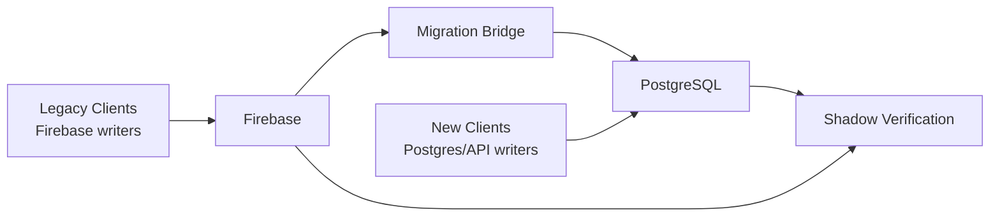

# Firebase to PostgreSQL Migration Plan

## Purpose

This document defines the recommended migration plan for moving Business Hub from the current Firebase-first operational model to the new PostgreSQL-first platform.

The goal is to:

- avoid a risky hard cutover
- keep live operations running during migration
- preserve auditability for financial and inventory history
- support offline mobile behavior safely
- prevent sync loops and stale overwrites during transition

This plan assumes:

- Firebase remains the current production path during the early migration
- PostgreSQL becomes the long-term source of truth
- migration happens domain by domain
- the bridge is **unidirectional per domain**

## Executive decision

### Do not perform a hard cutover

Business Hub should not attempt a "big bang" migration from Firebase to PostgreSQL.

The correct pattern is:

- backfill
- parallel run
- shadow verification
- domain ownership transfer
- staged retirement of Firebase

### Core safety rule

For any given domain, there must be **only one master write system at a time**.

That means:

- if `Inventory` is still Firebase-owned, Firebase is the writer and Postgres is the replica
- once `Inventory` is cut over, Postgres is the writer and Firebase becomes read-only replica or legacy compatibility shadow for that domain

Never allow true bidirectional write ownership for the same domain.

## Migration model

## Migration phases

### Phase 1: Schema and mapping design

Build the PostgreSQL schema first.

Requirements:

- preserve Firebase identifiers
- preserve source timestamps where meaningful
- preserve immutable financial facts
- add migration metadata fields

Recommended metadata fields on migrated tables:

- `source_system`
- `source_id`
- `source_shop_id`
- `source_path`
- `migrated_at`
- `created_at`
- `updated_at`
- `server_committed_at`
- `domain_epoch`
- `schema_version`

### Phase 2: Snapshot backfill

Backfill Firebase data into PostgreSQL.

Rules:

- migrate append-only facts as facts
- do not recalculate history destructively
- keep original financial values as captured facts
- derived totals can be rebuilt later from the fact tables

### Phase 3: Live bridge

This is the danger zone and must be designed carefully.

The bridge should do two jobs:

1. keep PostgreSQL updated from still-Firebase-owned domains
2. optionally keep Firebase shadow data updated from already-Postgres-owned domains for legacy read compatibility

### Phase 4: Shadow verification

Before shifting reads or writes, compare Firebase and PostgreSQL results silently.

Required checks by shop and time window:

- sales count
- sales total
- payment totals
- customer balances
- current stock values
- staff and attendance counts where relevant

### Phase 5: Domain cutover

Shift ownership domain by domain with feature flags and explicit epoching.

### Phase 6: Firebase retirement

After successful verification and stable production behavior:

- disable legacy write paths
- keep Firebase in read-only/archive mode temporarily if needed
- retire remaining dependency paths

## Domain ownership model

Each domain should carry an explicit ownership state:

- `firebase_primary`
- `dual_run_bridge_only`
- `postgres_primary`
- `retired`

This state must be controlled centrally, not inferred ad hoc by clients.

### Recommended domain cutover order

1. shop settings
2. inventory
3. customers
4. expenses
5. staff / attendance
6. sales and payments
7. reports / analytics
8. legacy import utilities

### Why sales and payments go late

Because they are:

- the most financially sensitive
- the hardest to reconcile
- the domains most likely to be affected by offline mobile behavior

## The live bridge rule

### Unidirectional per domain

This is the most important rule in the entire migration.

For each domain:

- **one system is master**
- the other system is replica/shadow only

Examples:

### Before inventory cutover

- Firebase owns inventory writes
- bridge copies inventory changes from Firebase to PostgreSQL
- PostgreSQL inventory writes are disabled

### After inventory cutover

- PostgreSQL owns inventory writes
- Firebase inventory becomes read-only shadow if still needed by legacy clients
- bridge copies inventory state from PostgreSQL to Firebase only if compatibility requires it
- legacy inventory writes must be rejected or converted to reconciliation events, never applied directly

## Preventing infinite sync loops

Every mirrored write must carry origin metadata:

- `origin_system`
- `origin_event_id`
- `bridge_applied_at`
- `bridge_direction`

Bridge rule:

- if a change already came from the bridge, the reverse bridge must ignore it

Never mirror a mirrored event back to its origin.

## Offline mobile reconnect conflict strategy

This is the critical edge case.

Example:

1. mobile client goes offline for hours
2. admin changes inventory price in Postgres
3. mobile client comes back and uploads stale mutations
4. system must not overwrite the new truth or create loops

### Core principle

When an offline client reconnects, its outbox must be treated as a set of **commands**, not a set of **authoritative records**.

That means the server should not say:

- "here is an old product document, overwrite the current row with it"

It should say:

- "the client attempted action X against base version Y; evaluate whether action X is still valid against current truth"

## Command-based reconciliation

Client outbox events should carry:

- `client_tx_id`
- `device_id`
- `user_id`
- `shop_id`
- `domain`
- `command_type`
- `base_version`
- `base_domain_epoch`
- `client_created_at`
- `payload`

### Required server checks on reconnect

1. Is the device/session still valid?
2. Is the domain still writable by this client generation?
3. Is the outbox event already applied?
4. Is the client operating against a stale domain epoch?
5. Does the command still make sense against current server truth?

## Conflict resolution by domain type

### Type A: Mutable reference/config data

Examples:

- item name
- selling price
- category assignment
- customer profile fields
- staff metadata

Rule:

- **server wins**

If the client command is based on an old version and the row changed since then:

- reject the stale mutation
- send back authoritative current record
- require client rehydrate/rebase before allowing another edit

Do not use naive last-write-wins.

### Type B: Append-only financial/inventory facts

Examples:

- sale creation
- payment creation
- stock movement
- attendance check-in
- audit event

Rule:

- validate as append-only command
- do not overwrite existing fact rows

The server should decide:

- accept
- reject
- manual-review

based on invariant checks.

Examples:

- a sale created offline at an old price may still be accepted if policy allows captured-price sales from offline mode
- a stock movement that would create impossible negative inventory may be rejected or forced into review depending on business policy

### Type C: Derived/counter state

Examples:

- stock totals
- dashboard counters
- customer balance snapshots

Rule:

- clients never write these directly
- recompute from committed facts only

An offline client must never push "final totals" as truth.

## Domain epoch strategy

Each cutover should increase a domain epoch.

Examples:

- `inventory_epoch = 3`
- `sales_epoch = 1`

Clients store the last known epoch.

When reconnecting:

- if client event epoch < current domain epoch and that domain is now `postgres_primary`
- the server must treat legacy writes as stale commands

Possible outcomes:

- reject and force rehydrate
- convert to reconciliation review item
- accept only if the command is append-only and still valid

This is how you stop a pre-cutover offline device from behaving like it still owns the old Firebase write model.

## Bridge behavior after a domain cutover

Once a domain becomes `postgres_primary`:

- legacy clients must not write authoritative state for that domain anymore
- Firebase becomes read-only shadow for that domain if still required

For old clients, you have three safe options:

### Option 1: Read-only legacy mode

Best for sensitive domains.

- old clients can read shadow data
- write attempts are blocked with upgrade/refresh message

### Option 2: Reconciliation intake mode

- old clients can still upload commands
- server evaluates them against Postgres truth
- nothing directly writes back into the master row model from Firebase documents

### Option 3: Domain disabled on legacy clients

Best once adoption is high.

- old client flow is shut off entirely

## Recommended behavior for stale reconnects

### Inventory domain after cutover

If offline legacy mobile reconnects and tries to push old inventory row state:

- reject mutation
- return current authoritative item
- require client refresh

Inventory reference data must not be overwritten by stale mobile snapshots.

### Sales domain during transition

If offline client reconnects with sale commands:

- treat each sale as append-only candidate
- check idempotency
- check policy version
- validate stock, totals, permissions
- commit to Postgres if valid
- create review queue item if ambiguous

This allows legitimate offline sales to survive without allowing stale record overwrites.

### Price mismatch policy

This must be a business rule, not an accidental side effect.

Recommended configurable behavior:

- `strict_current_price`
- `allow_offline_captured_price_with_audit`
- `manual_review_if_price_drift_exceeds_threshold`

Without an explicit rule here, migrations become unpredictable.

## Stale timestamp handling

Never trust client timestamps as ordering truth by themselves.

Use:

- server commit time
- domain epoch
- base version
- idempotency key
- command semantics

Client timestamps are useful for:

- display
- diagnostics
- offline event chronology

They are not enough to decide conflict ownership.

## Idempotency requirements

Every mobile outbox event must be idempotent.

Recommended unique keys:

- `client_tx_id`
- `device_id`
- `command_type`

Server behavior:

- first valid apply commits
- repeats return prior outcome
- duplicate retries do not create duplicate sales or payments

## Manual review queue

Not every conflict should auto-resolve.

Create a reconciliation queue for:

- impossible stock state
- duplicate-but-not-identical sales
- extreme price drift
- permission mismatch
- stale command against heavily changed entity

Suggested table:

- `migration_reconciliation_events`

Fields:

- `domain`
- `shop_id`
- `client_tx_id`
- `device_id`
- `reason`
- `severity`
- `payload`
- `server_snapshot`
- `status`
- `resolved_by`
- `resolved_at`

## Shadow verification rules

Before and after each domain cutover, verify:

### Inventory

- item count
- active item count
- low-stock count
- price parity
- cost parity

### Customers

- customer count
- open-balance total
- per-customer balance samples

### Sales and payments

- sales count by day
- gross sales by day
- payment totals by method
- refunds/voids count

### Attendance

- session count
- total hours
- active shift state

## Feature flags and rollout

Every cutover must be gated by:

- domain
- shop
- environment
- optionally user cohort

This allows:

- pilot shop rollout
- rollback without global outage
- selective debugging

## Rollback policy

Rollback must be domain-specific.

If a domain cutover fails:

- switch reads/writes back to prior owner
- freeze bridge direction for that domain
- preserve captured events for replay
- do not discard Postgres state; diagnose and reconcile

## Final recommendation

The safe conflict policy is:

- **commands, not document overwrites**
- **server-owned versions, not client timestamps**
- **one write master per domain**
- **append-only facts where possible**
- **manual review for ambiguous financial conflicts**

That is how Business Hub should handle offline reconnects without sync loops, silent overwrites, or stale Firebase data corrupting the new PostgreSQL truth.

## Suggested next implementation artifacts

After this document, the next concrete docs should be:

1. `firebase-to-postgres-schema-map.md`
2. `domain-cutover-matrix.md`
3. `migration-reconciliation-runbook.md`
4. `legacy-client-compatibility-policy.md`
