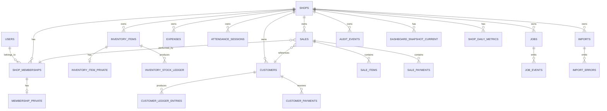

# Firebase to PostgreSQL Schema Map

## Purpose

This document maps the current Business Hub Firebase-era data model to the recommended PostgreSQL-era relational model.

It is designed to unblock:

- backend module design
- migration backfill work
- bridge implementation
- reconciliation queries
- API contract planning

This is a **target-state schema map**, not a guarantee that every table already exists in code.

## Mapping principles

### 1. Preserve source identity

Every migrated record should preserve where it came from.

Recommended metadata on migrated tables:

- `source_system`
- `source_id`
- `source_shop_id`
- `source_path`
- `migrated_at`
- `domain_epoch`

### 2. Facts over snapshots

Append-only business facts should stay append-only:

- sales
- payments
- stock movements
- customer ledger entries
- attendance events where applicable
- audit events

### 3. Derived values become projections

Do not treat derived summaries as canonical truth.

Examples:

- customer balance
- dashboard total
- low-stock count
- payment mix charts

These should be projections rebuilt from fact tables.

### 4. One domain, one owner

The schema supports migration ownership states, but at runtime:

- one master system owns writes per domain
- replicated shadow state is not authoritative

## Canonical PostgreSQL module groups

The target PostgreSQL data model should be organized into these groups:

### Identity and tenancy

- `users`
- `shops`
- `shop_memberships`
- `membership_permissions`
- `membership_private`
- `devices`

### Inventory

- `inventory_items`
- `inventory_item_private`
- `inventory_stock_ledger`
- `inventory_adjustments`
- `inventory_snapshots`

### Sales and checkout

- `sales`
- `sale_items`
- `sale_payments`
- `sale_discounts`
- `sale_returns`

### Customers and credit

- `customers`
- `customer_ledger_entries`
- `customer_payments`
- `customer_balance_snapshots`

### Team and attendance

- `staff_sessions` or `attendance_sessions`
- `attendance_adjustments`
- `payroll_summary_monthly`

### Expenses and finance

- `expenses`
- `expense_categories`

### Operations

- `jobs`
- `job_events`
- `imports`
- `import_errors`
- `exports`
- `notifications`
- `audit_events`
- `backup_archives`

### Aggregates and projections

- `dashboard_snapshot_current`
- `shop_daily_metrics`
- `shop_monthly_metrics`
- `inventory_low_stock_snapshot`
- `inventory_velocity_snapshot`
- `sales_payment_mix_daily`

## Core relational model

## Collection-to-table mapping

### 1. `users/{userId}`

### Firebase shape

Fields commonly seen:

- `email`
- `shopId`
- `role`
- `updatedAt`

### PostgreSQL target

#### `users`

Columns:

- `id`
- `email`
- `auth_provider`
- `status`
- `created_at`
- `updated_at`
- `source_system`
- `source_id`
- `source_path`

#### `shop_memberships`

Columns:

- `id`
- `shop_id`
- `user_id`
- `role`
- `status`
- `joined_at`
- `updated_at`
- `source_system`
- `source_id`
- `source_path`

### Notes

- do not overload `users` with shop-specific role data long term
- user identity and shop membership should be separated

### 2. `shops/{shopId}`

### Firebase shape

- `ownerId`
- `name`
- `settings`
- `inviteCode`
- `createdAt`

### PostgreSQL target

#### `shops`

Columns:

- `id`
- `owner_user_id`
- `name`
- `invite_code`
- `status`
- `settings_json`
- `created_at`
- `updated_at`
- `source_system`
- `source_id`
- `source_path`

### Notes

- keep raw shop settings in JSON early if needed
- peel stable settings into typed columns over time only if they prove operationally important

### 3. `shops/{shopId}/staff/{staffId}`

### Firebase shape

- `id`
- `role`
- `status`
- `email`
- `phone`
- `permissions`
- `updatedAt`

### PostgreSQL target

#### `shop_memberships`

Map:

- `staff.id` -> `user_id` or legacy external reference depending migration quality
- `role` -> `role`
- `status` -> `status`
- `email` -> use for identity recovery / duplicate analysis only, not final authority if auth system differs
- `phone` -> optional member contact field
- `updatedAt` -> `updated_at`

#### `membership_permissions`

Columns:

- `membership_id`
- `permission_key`
- `permission_value`
- `updated_at`

### Notes

- Firebase `permissions` map should be normalized into row or JSON-based permission storage
- for early migration, `permissions_json` in `shop_memberships` is acceptable, but typed permission expansion is better long term

### 4. `shops/{shopId}/staff_private/{staffId}`

### Firebase shape

- `salary`
- `pin`
- `updatedAt`

### PostgreSQL target

#### `membership_private`

Columns:

- `membership_id`
- `salary_amount`
- `pin_hash`
- `updated_at`
- `source_system`
- `source_path`

### Notes

- never migrate raw PIN as plain value in the new system
- hash or rotate as part of migration

### 5. `shops/{shopId}/inventory/{itemId}`

### Firebase shape

- `name`
- `price`
- `sku`
- `category`
- `subcategory`
- `size`
- `stock`
- `sourceMeta`
- `createdAt`
- `updatedAt`
- `tombstone`

### PostgreSQL target

#### `inventory_items`

Columns:

- `id`
- `shop_id`
- `name`
- `sku`
- `barcode`
- `category`
- `subcategory`
- `size`
- `description`
- `sell_price`
- `status`
- `tombstone`
- `created_at`
- `updated_at`
- `source_meta_json`
- `source_system`
- `source_id`
- `source_path`

### Important note

Firebase `stock` should not remain the long-term canonical stock truth.

Use:

- `inventory_stock_ledger` for append-only movements
- `inventory_snapshots` or computed current-stock view for fast reads

During migration:

- backfill current `stock` into an opening stock ledger event

### 6. `shops/{shopId}/inventory_private/{itemId}`

### Firebase shape

- `costPrice`
- `supplierId`
- `lastPurchaseDate`
- `updatedAt`
- `tombstone`

### PostgreSQL target

#### `inventory_item_private`

Columns:

- `item_id`
- `cost_price`
- `supplier_id`
- `last_purchase_date`
- `updated_at`
- `tombstone`
- `source_system`
- `source_path`

### 7. `shops/{shopId}/sales/{saleId}`

### Firebase shape

- `total`
- `discount`
- `discountType`
- `paymentMode`
- `customerName`
- `customerPhone`
- `customerId`
- `footerNote`
- `date`
- `createdAt`
- `updatedAt`
- `staffId`
- `tombstone`

### PostgreSQL target

#### `sales`

Columns:

- `id`
- `shop_id`
- `customer_id`
- `performed_by_membership_id`
- `sale_date`
- `currency_code`
- `subtotal_amount`
- `discount_amount`
- `discount_type`
- `tax_amount`
- `total_amount`
- `payment_mode_legacy`
- `footer_note`
- `source_meta_json`
- `created_at`
- `updated_at`
- `server_committed_at`
- `tombstone`
- `source_system`
- `source_id`
- `source_path`

#### `sale_items`

Source:

- web local SQLite already stores normalized `sale_items`
- Flutter mobile currently stores items JSON inside sales row

Columns:

- `id`
- `shop_id`
- `sale_id`
- `inventory_item_id`
- `display_name`
- `quantity`
- `unit_price`
- `unit_cost_price`
- `size`
- `is_return`

#### `sale_payments`

Columns:

- `id`
- `shop_id`
- `sale_id`
- `payment_method`
- `amount`
- `reference`
- `created_at`

### Notes

- this domain should be treated as append-only financial fact storage
- if Firestore sales currently embed items/payments or rely on local-only normalization, migration must reconstruct normalized rows during backfill

### 8. `shops/{shopId}/customers/{customerId}`

### Firebase shape

- `name`
- `phone`
- `email`
- `totalSpent`
- `balance`
- `createdAt`
- `updatedAt`
- `tombstone`

### PostgreSQL target

#### `customers`

Columns:

- `id`
- `shop_id`
- `name`
- `phone`
- `email`
- `status`
- `created_at`
- `updated_at`
- `tombstone`
- `source_system`
- `source_id`
- `source_path`

#### `customer_balance_snapshots`

Columns:

- `customer_id`
- `shop_id`
- `balance_amount`
- `total_spent_amount`
- `snapshot_at`

#### `customer_ledger_entries`

Needed because final balance should be derived from facts:

- `id`
- `shop_id`
- `customer_id`
- `entry_type`
- `amount`
- `reference_type`
- `reference_id`
- `created_at`
- `source_system`
- `source_path`

### Notes

- Firebase `balance` and `totalSpent` should be treated as migration/bootstrap values, not long-term sole truth

### 9. `customer_payments` local/web path

### Current state

This appears in the web local SQLite schema but is not clearly surfaced as a first-class Firestore collection in the current ERD.

### PostgreSQL target

#### `customer_payments`

Columns:

- `id`
- `shop_id`
- `customer_id`
- `amount`
- `payment_method`
- `reference`
- `payment_date`
- `created_at`
- `updated_at`
- `source_system`

### Notes

- if Firebase stores these under another structure or inside sales/payment flows, the migration must canonicalize them here

### 10. `shops/{shopId}/expenses/{expenseId}`

### Firebase shape

- `category`
- `amount`
- `description`
- `paymentMethod`
- `paymentReference`
- `date`
- `createdAt`
- `updatedAt`
- `tombstone`

### PostgreSQL target

#### `expenses`

Columns:

- `id`
- `shop_id`
- `expense_category`
- `amount`
- `description`
- `payment_method`
- `payment_reference`
- `expense_date`
- `created_at`
- `updated_at`
- `tombstone`
- `source_system`
- `source_id`
- `source_path`

### 11. `shops/{shopId}/attendance/{attendanceId}`

### Firebase shape

- `staffId`
- `date`
- `clockIn`
- `clockOut`
- `status`
- `totalHours`
- `overtime`
- `bonus`
- `note`
- `updatedAt`
- `tombstone`

### PostgreSQL target

#### `attendance_sessions`

Columns:

- `id`
- `shop_id`
- `membership_id`
- `attendance_date`
- `clock_in_at`
- `clock_out_at`
- `status`
- `total_hours`
- `overtime_hours`
- `bonus_amount`
- `note`
- `updated_at`
- `tombstone`
- `source_system`
- `source_id`
- `source_path`

### Notes

- if payroll later becomes more sophisticated, keep attendance facts separate from payroll summaries

### 12. `shops/{shopId}/invitations/{invitationId}`

### Firebase shape

- sparse admin utility record

### PostgreSQL target

#### `shop_invitations`

Columns:

- `id`
- `shop_id`
- `email`
- `role`
- `invite_code`
- `status`
- `created_at`
- `expires_at`
- `accepted_at`
- `source_system`

### 13. `shops/{shopId}/jobs/{jobId}`

### Firebase shape

- `type`
- `status`
- `createdAt`

### PostgreSQL target

#### `jobs`

Columns:

- `id`
- `shop_id`
- `job_type`
- `status`
- `created_by_user_id`
- `progress_percent`
- `created_at`
- `started_at`
- `finished_at`
- `retry_count`
- `error_summary`
- `source_system`
- `source_path`

#### `job_events`

Columns:

- `id`
- `job_id`
- `event_type`
- `payload_json`
- `created_at`

### 14. `shops/{shopId}/imports/{importId}`

### Firebase shape

- `type`
- `status`
- `createdAt`

### PostgreSQL target

#### `imports`

Columns:

- `id`
- `shop_id`
- `import_type`
- `status`
- `created_by_user_id`
- `source_file_url`
- `created_at`
- `started_at`
- `finished_at`
- `error_summary`

#### `import_errors`

Columns:

- `id`
- `import_id`
- `row_number`
- `error_code`
- `error_message`
- `payload_json`
- `created_at`

### 15. `shops/{shopId}/backup_archives/{archiveId}`

### PostgreSQL target

#### `backup_archives`

Columns:

- `id`
- `shop_id`
- `label`
- `trigger`
- `storage_url`
- `size_bytes`
- `created_at`

### 16. Aggregate and summary collections

### Firebase examples

- `dashboard_snapshot/current`
- daily aggregates
- customer credit summaries
- staff payroll summaries

### PostgreSQL target

These should become projection tables, such as:

- `dashboard_snapshot_current`
- `shop_daily_metrics`
- `shop_monthly_metrics`
- `customer_balance_snapshots`
- `payroll_summary_monthly`
- `inventory_low_stock_snapshot`
- `inventory_velocity_snapshot`

### Notes

- these are not canonical truth
- workers or scheduled jobs rebuild them from fact tables

## Migration-specific support tables

The PostgreSQL platform should also include migration support tables.

### `migration_bridge_events`

Purpose:

- track bridged events
- prevent bridge loops

Columns:

- `id`
- `domain`
- `shop_id`
- `origin_system`
- `origin_event_id`
- `direction`
- `applied_at`
- `status`

### `migration_domain_ownership`

Purpose:

- track which system owns a domain

Columns:

- `domain`
- `shop_id`
- `owner_system`
- `domain_epoch`
- `effective_at`

### `migration_reconciliation_events`

Purpose:

- capture ambiguous stale reconnects or mismatch cases

Columns:

- `id`
- `domain`
- `shop_id`
- `client_tx_id`
- `device_id`
- `reason`
- `severity`
- `payload_json`
- `server_snapshot_json`
- `status`
- `resolved_by`
- `resolved_at`
- `created_at`

## Suggested implementation order

Backend-first priority order:

1. `users`
2. `shops`
3. `shop_memberships`
4. `inventory_items`
5. `inventory_item_private`
6. `customers`
7. `sales`
8. `sale_items`
9. `sale_payments`
10. `expenses`
11. `attendance_sessions`
12. migration support tables
13. projection tables

## Final recommendation

This schema map should be used as the translation layer between:

- the current Firebase hierarchy
- the current web/admin local SQLite model
- the future PostgreSQL source of truth

The most important design choices are:

- normalize sales/items/payments
- separate identity from shop membership
- move balances and stock totals toward ledger/projection design
- preserve source metadata through migration
- include migration-control tables from day one

## Suggested next artifacts

After this schema map, the next concrete docs should be:

1. `domain-cutover-matrix.md`
2. `migration-reconciliation-runbook.md`
3. `legacy-client-compatibility-policy.md`
4. `postgres-module-boundaries.md`
