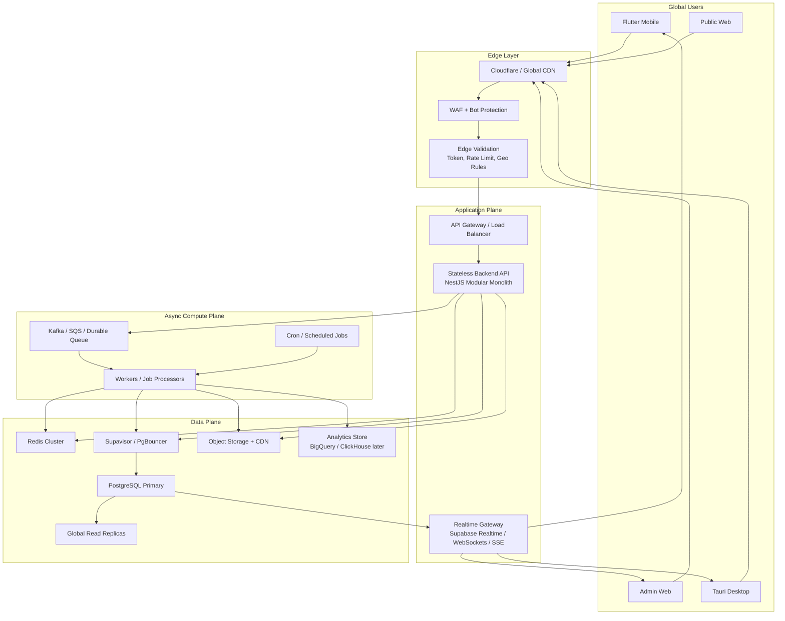
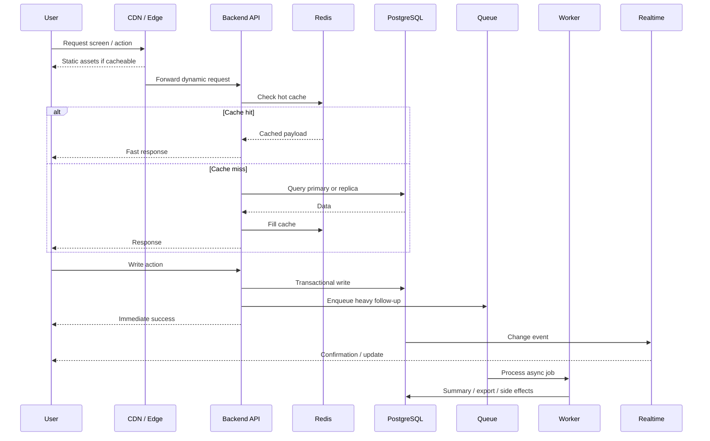

# Business Hub High-Scale Global Architecture

## Purpose

This document translates the target Business Hub platform architecture into a concrete deployment architecture for:

- global rollout
- `1 crore` (`10,000,000`) records and beyond
- `1 lakh` (`100,000`) requests per second class traffic
- low-latency user experience
- operational safety during flash sales, imports, and spikes

This is not the minimum architecture to launch.

This is the architecture to grow into if Business Hub becomes a large multi-region business platform.

## Executive answer

### Can this architecture handle `1 crore` records?

Yes, comfortably.

For PostgreSQL, `10 million` rows is not a scary number if:

- queries are indexed correctly
- large tables are partitioned
- dashboard reads come from summary tables
- clients do not scan raw rows for UI rendering

### Can this architecture handle `1 lakh` RPS?

Yes, but **not with a single app server and a single database node**.

At that scale, the architecture must be deployed with:

- global CDN and edge caching
- stateless horizontally scaled APIs
- Redis absorbing most hot reads
- connection pooling between API and Postgres
- read replicas near major traffic regions
- dedicated worker and queue infrastructure
- strict separation between hot operational reads and heavy background processing

### Candid reality

`100k RPS` is not "normal SaaS traffic". It is enterprise / media / flash-sale scale.

The architecture still works, but only if the infrastructure is upgraded around it.

## Recommended global target architecture

## Architecture principles

### 1. Edge-first delivery

The first job of the system is to prevent unnecessary requests from ever touching the core backend.

Use the edge for:

- static asset delivery
- public marketing pages
- route-level CDN caching
- bot filtering
- rate limiting
- JWT validation where possible
- geo-based request steering

At `100k RPS`, most safe reads should be absorbed before they hit the API tier.

### 2. API is stateless

The backend API must remain stateless.

That means:

- no in-memory session assumptions
- no sticky-user logic
- no file storage on app instances
- no local queues inside the API container

This allows:

- horizontal scaling
- rapid replacement of instances
- multiple regions
- simpler autoscaling

### 3. PostgreSQL is the primary source of truth

The primary writer remains PostgreSQL.

Use Postgres for:

- all transactional writes
- ledgers
- inventory truth
- payments
- balances
- audit
- jobs metadata

The point is not to make Postgres serve every request directly.

The point is to make Postgres the correct truth and place fast layers in front of it.

### 4. Redis absorbs the hot read path

Redis should carry:

- dashboard snapshots
- low-stock counts
- active POS config
- active shop pricing caches
- hot product/category lookups
- request rate state
- idempotency keys
- short TTL session-adjacent metadata

At very high scale, Redis becomes the difference between:

- a stable API
- and a database outage caused by repeated identical reads

### 5. Realtime is selective

Realtime should be used only where the UX actually needs immediacy:

- active sale confirmation
- job progress
- stock changes visible to currently open POS sessions
- notifications
- presence

Do not use realtime as the default query mechanism for every screen.

### 6. Heavy work never blocks the request path

Anything slower than a fast transaction should be queued:

- imports
- export generation
- PDF builds
- analytics recompute
- nightly summaries
- anomaly detection
- mass notifications

The API should enqueue and return.

## Data volume strategy

## `1 crore` records is straightforward

The core requirement for `10 million` rows is not a new database product.

It is:

- good schema design
- correct indexing
- partitioning
- summary tables
- avoiding client-side heavy scans

### Required database practices

#### Indexing

Every major lookup path must be indexed.

Examples:

- `sales(shop_id, created_at desc)`
- `sale_items(shop_id, sale_id)`
- `inventory_items(shop_id, sku)`
- `inventory_items(shop_id, barcode)`
- `customers(shop_id, phone)`
- `customers(shop_id, lower(name))`
- `attendance_sessions(shop_id, started_at desc)`

#### Partitioning

Partition the large append-heavy tables.

Recommended:

- `sales`
- `sale_items`
- `sale_payments`
- `inventory_stock_ledger`
- `customer_ledger_entries`
- `attendance_sessions`
- `audit_events`
- `job_events`

Recommended partition key:

- monthly range by `created_at` or business date

Optional later:

- sub-partition by hash of `shop_id` if a single month partition becomes too hot

#### Summary tables

Dashboards should not derive from raw sales rows at request time.

Use:

- `dashboard_snapshot_current`
- `shop_daily_metrics`
- `inventory_low_stock_snapshot`
- `customer_balance_snapshot`
- `sales_payment_mix_daily`

These should be updated by workers or lightweight event processors.

## Request-per-second strategy

## `100k RPS` means request triage

At that scale, not all requests are equal.

Split traffic into four classes:

### Class A: static delivery

Handled by CDN only:

- JS bundles
- CSS
- fonts
- images
- public pages

Target:
- backend never sees most of this

### Class B: cached reads

Handled by edge cache or Redis-backed API reads:

- dashboard summary
- shop config
- low-stock count
- public catalog previews

Target:
- response under tens of milliseconds

### Class C: transactional reads and writes

Handled by API plus Postgres:

- create sale
- edit product
- create customer
- attendance check-in

Target:
- keep these small and well-indexed

### Class D: asynchronous heavy jobs

Handled by queue and workers:

- imports
- exports
- PDF receipts if slow
- bulk reconciliation
- payroll batch generation

Target:
- never hold open a user request while this runs

## Global deployment topology

### Recommended production shape

#### Global edge

- Cloudflare or equivalent global CDN
- WAF
- rate limiting
- bot mitigation
- static asset caching

#### Primary app region

Pick one primary write region close to your largest operational market.

If the current core user base is India, a practical first anchor is:

- Mumbai or nearby region for API + Postgres primary

#### Read regions

Add read replicas in major geographies when needed:

- Europe
- North America
- Middle East / Asia-Pacific depending on traffic

#### Realtime region alignment

Realtime services should be placed near the primary database and near heavy active-user clusters.

If using Supabase Realtime, keep in mind it streams database changes via logical replication and should stay close to the primary database plane.

## Read replica strategy

Read replicas are for:

- reporting reads
- history browsing
- non-critical analytics reads
- admin dashboards where slightly stale data is acceptable

Do not send critical write-dependent reads to distant replicas when the user needs strict read-after-write consistency.

### Use primary reads for:

- immediate post-sale checks
- stock validation
- payment confirmation
- security-sensitive state

### Use replica reads for:

- historical browsing
- charts
- month-over-month analytics
- exports staging

## Queue strategy

### Starting point

For moderate scale:

- Redis queue or managed simple queue is acceptable

### High-scale target

For extreme burst tolerance, use:

- **Kafka** if event stream durability and replay are central
- **AWS SQS** if you want simpler managed durability and decoupling

Recommended practical path:

- start with managed durable queue
- move to Kafka only if event throughput, replay, or fanout justify the complexity

Business Hub likely does **not** need Kafka on day one.

But the architecture should allow that upgrade later.

## Connection management

At high scale, database connection count becomes a hard bottleneck.

That is why all API and worker traffic must go through:

- Supavisor
- dedicated PgBouncer
- or equivalent transaction/session pooler depending runtime

### Practical rules

- direct DB connections only for tightly controlled internal tasks
- pooled connections for APIs and workers
- transaction mode for high churn serverless/elastic usage
- dedicated local pooler near the database for lowest latency when available

## Managed services vs self-hosting

## Recommended answer for Business Hub

Use **managed services first**.

Recommended first serious production path:

- Supabase Cloud for Postgres, Auth, Realtime, Storage, pooler
- Vercel or Cloudflare for web delivery
- Cloud Run / Fly.io / Railway / similar for backend API and workers
- managed Redis
- managed queue

### Why not self-host first

Self-hosting everything on raw VMs gives control, but it also gives you responsibility for:

- Postgres failover
- backups
- replication health
- pooler health
- queue durability
- certificate rotation
- observability
- autoscaling
- incident response

That is the wrong tradeoff early unless you already have an infrastructure team.

### When self-hosting becomes worth it

Only consider full self-hosting later if:

- compliance requires it
- cloud cost becomes a proven bottleneck
- performance tuning requires deep infra customization
- the team is ready to own database and queue operations directly

## Best-in-class request flow

## Operational scale tiers

### Tier 1: launch to early growth

- single primary Postgres
- managed pooler
- single-region API
- CDN
- Redis
- basic workers

This is enough for:

- real production
- strong SME growth
- millions of rows

### Tier 2: national scale

- stronger Redis setup
- multiple API instances
- dedicated worker fleet
- partitioned tables
- read replicas
- richer observability

### Tier 3: global enterprise scale

- multi-region edge routing
- multiple read regions
- strict cache strategy
- durable queue at high throughput
- warehouse / analytics offload
- advanced failover drills

## Recommended Business Hub version of this architecture

### Frontends

- Flutter mobile app
- Next.js admin web
- Next.js public web
- Tauri desktop shell for packaged desktop

### Backend

- NestJS modular monolith first
- separate worker runtime using the same domain modules

### Core platform

- Supabase Postgres
- Supabase Auth
- Supabase Realtime
- Supabase Storage
- Supavisor or dedicated PgBouncer

### Scale support

- Redis
- managed queue
- read replicas
- global CDN / WAF
- observability stack

### Future optional upgrade

If the system ever needs extreme multi-region write scaling far beyond realistic business operations:

- evaluate distributed SQL such as CockroachDB

But do **not** start there.

PostgreSQL should be exhausted first.

## Final recommendation

For Business Hub:

- `1 crore records` is not the scary part
- `1 lakh RPS` is the infrastructure problem, not the schema problem

So the best architecture is:

- **Postgres-centered**
- **edge-cached**
- **Redis-accelerated**
- **pooled**
- **read-replica aware**
- **worker-driven**
- **selectively realtime**
- **managed first**

That is the cleanest path to a globally deployable Business Hub platform with smooth UX and controllable complexity.

## References

- [Supabase Architecture](https://supabase.com/docs/architecture)
- [Supabase Realtime Architecture](https://supabase.com/docs/guides/realtime/architecture)
- [Supabase Connection Management](https://supabase.com/docs/guides/database/connection-management)
- [Supabase Pooler Modes](https://supabase.com/docs/reference/postgres/connection-strings)
- [PostgreSQL Logical Replication](https://www.postgresql.org/docs/current/static/logical-replication.html)
- [PostgreSQL Table Partitioning](https://www.postgresql.org/docs/current/static/ddl-partitioning.html)
- [Flutter Performance Best Practices](https://docs.flutter.dev/perf/best-practices)
- [Flutter Concurrency and Isolates](https://docs.flutter.dev/perf/isolates)
- [Next.js Caching](https://nextjs.org/docs/app/guides/caching)
- [Next.js CDN Caching](https://nextjs.org/docs/app/guides/cdn-caching)
