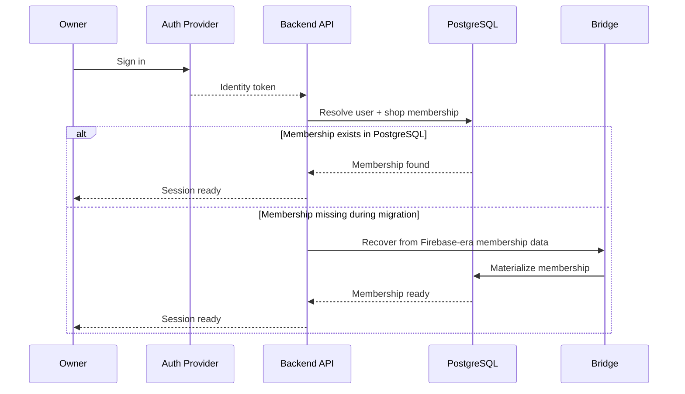
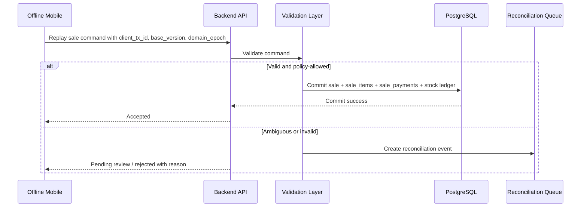
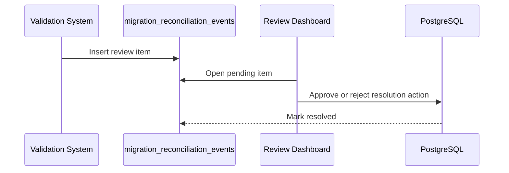

# Business Hub Platform Scenarios and Operational Flows

## Purpose

This document turns the architecture and migration strategy into concrete scenarios.

It answers:

- what happens in normal user flows
- what happens during migration
- what happens during offline reconnect
- what happens when conflicts occur
- what happens when a cutover or rollback is triggered

This is the "how the system behaves in real life" companion to the architecture docs.

## Scenario map

This document covers:

1. owner signs in to the new platform
2. inventory read before and after cutover
3. admin updates product price during migration
4. offline mobile sale and reconnect
5. stale mutable write rejection
6. reconciliation queue review
7. shadow verification mismatch
8. domain cutover
9. rollback
10. final Firebase retirement

## Scenario 1: Owner signs in on the new platform

### Goal

Get the owner into the new admin/mobile system without changing the auth system and data system at the same time.

### Flow

### Important behavior

- auth and data migration are decoupled
- missing membership can be recovered without blocking the user permanently

## Scenario 2: Inventory read before and after cutover

### Before cutover

- Firebase is inventory master
- bridge replicates to PostgreSQL
- old clients can write inventory
- new services should not authoritatively write inventory yet

### After cutover

- PostgreSQL is inventory master
- Firebase inventory becomes read-only shadow if legacy clients still need reads
- new write requests go only through Postgres/API

### Result

- one write master per domain
- no split-brain inventory truth

## Scenario 3: Admin updates product price during migration

### Before inventory cutover

1. admin updates product through old Firebase-owned path
2. Firebase stores change
3. bridge replicates change into PostgreSQL
4. shadow verification confirms parity

### After inventory cutover

1. admin updates product through Postgres/API
2. PostgreSQL commits authoritative row
3. optional shadow replication updates Firebase for legacy read-only compatibility
4. old legacy write attempts are rejected or turned into reconciliation events

### Rule

Once a domain is `postgres_primary`, no legacy client can overwrite it with stale row state.

## Scenario 4: Offline mobile sale and reconnect

### Situation

- mobile device is offline for hours
- customer buys items
- device stores sale locally
- device later reconnects

### Correct server behavior

Treat the reconnect payload as **commands**, not records.

### Flow

### Why this is safe

- a legitimate offline sale can still survive
- stale row snapshots cannot blindly overwrite server truth

## Scenario 5: Stale mutable write rejection

### Situation

- device was offline
- admin changed product price centrally
- device comes back and tries to upload old product row snapshot

### Correct behavior

- reject the mutable overwrite
- return authoritative current product record
- tell the client to refresh before attempting another edit

### Why

Inventory metadata is mutable reference data.

For this class of data:

- **server wins**

## Scenario 6: Reconciliation queue review

### Situation

An ambiguous event cannot be auto-resolved.

Example:

- sale at old offline price
- not obviously fraudulent
- but price drift exceeds normal threshold

### Flow

### Product implication

You need a secure admin review UI for:

- approve
- reject
- annotate
- replay if safe

This is a real feature, not just a background table.

## Scenario 7: Shadow verification mismatch

### Situation

After backfill or during bridge operation:

- Firebase totals and PostgreSQL totals diverge

### Example mismatch

- Firebase sales count for day = `1,452`
- PostgreSQL sales count for day = `1,449`

### Correct response

1. stop planned cutover for that domain/shop
2. inspect mismatch dashboard
3. query missing IDs
4. determine whether:
   - bridge lag
   - backfill miss
   - duplicate suppression bug
   - rejected stale replay

### Rule

Do not cut over a financially sensitive domain while shadow verification is red.

## Scenario 8: Domain cutover

### Example: Inventory cutover

1. backfill inventory into PostgreSQL
2. run bridge from Firebase to PostgreSQL
3. verify parity
4. flip `inventory` to `postgres_primary`
5. increment `inventory_epoch`
6. reject legacy inventory writes
7. optionally maintain Firebase shadow reads until old clients are retired

### Expected result

- inventory writes now live only on Postgres
- stale clients are detected using domain epoch

## Scenario 9: Rollback

### Situation

Inventory cutover succeeds for most users but reveals a serious issue for a pilot shop.

### Rollback flow

1. feature flag routes inventory reads/writes back to prior owner for that shop
2. bridge direction for inventory freezes
3. captured bridge/reconciliation events are preserved
4. diagnosis happens without losing the event trail

### Important rule

Rollback must be **domain-scoped** and preferably **shop-scoped**, not global by default.

## Scenario 10: Final Firebase retirement

### Preconditions

- all major domains are `postgres_primary`
- legacy write paths are disabled
- shadow verification remains clean through observation period
- mobile and web clients no longer depend on Firebase operationally for those domains

### Flow

1. disable remaining Firebase writes
2. keep archive/read-only access temporarily if needed
3. remove bridge for retired domains
4. decommission legacy dependencies gradually

## Operational scenarios by actor

### Owner

- can sign in during migration
- can use the new platform even if some domains still bridge from Firebase
- may need access to reconciliation dashboard for shop-level resolution

### Cashier / staff

- can keep using offline mode where supported
- may see "refresh required" for stale mutable writes after a domain cutover
- should not silently lose completed valid sales

### Admin / support

- monitors mismatch dashboards
- processes reconciliation queue
- controls feature flags and domain cutover rollout

### Engineering / SRE

- monitors bridge health
- monitors lag and mismatches
- runs cutover and rollback playbooks

## Key operational rules

### Rule 1

One master write system per domain.

### Rule 2

Offline reconnects are command replay, not record overwrite.

### Rule 3

Mutable reference data uses server-wins conflict policy.

### Rule 4

Append-only financial facts use accept/reject/review flow.

### Rule 5

Derived totals are never client authority.

### Rule 6

No domain cutover without green shadow verification.

## What this means for implementation

To make these scenarios real, the implementation must include:

- domain ownership service
- domain epoch storage
- bridge origin metadata
- idempotency enforcement
- reconciliation queue
- admin review UI
- mismatch dashboards
- cutover feature flags
- rollback playbooks

## Final recommendation

If Business Hub follows the migration strategy and the scenarios in this document, the platform can move from Firebase to PostgreSQL without relying on dangerous assumptions like:

- last-write-wins
- document overwrites
- silent stale client acceptance
- undefined rollback behavior

This is the scenario-level operational playbook for the architecture.
