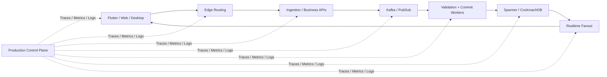
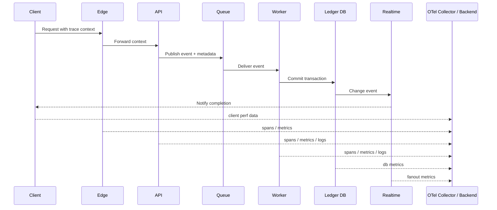
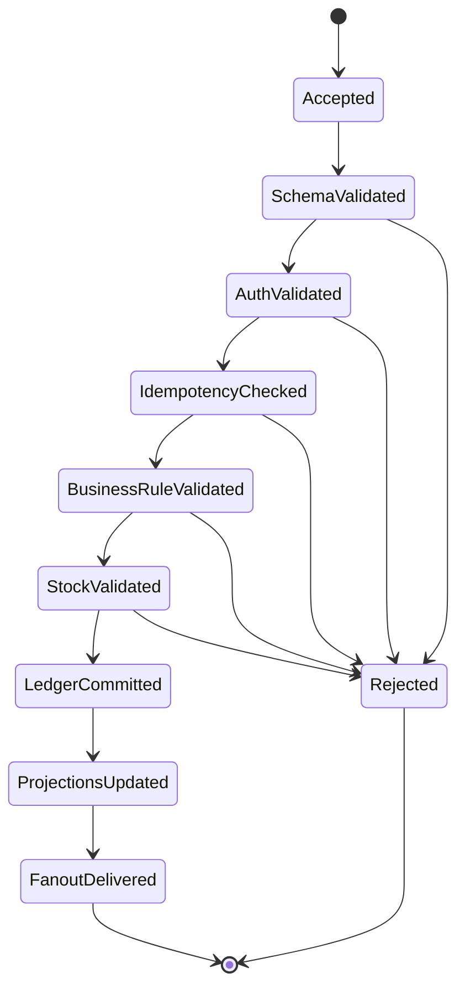
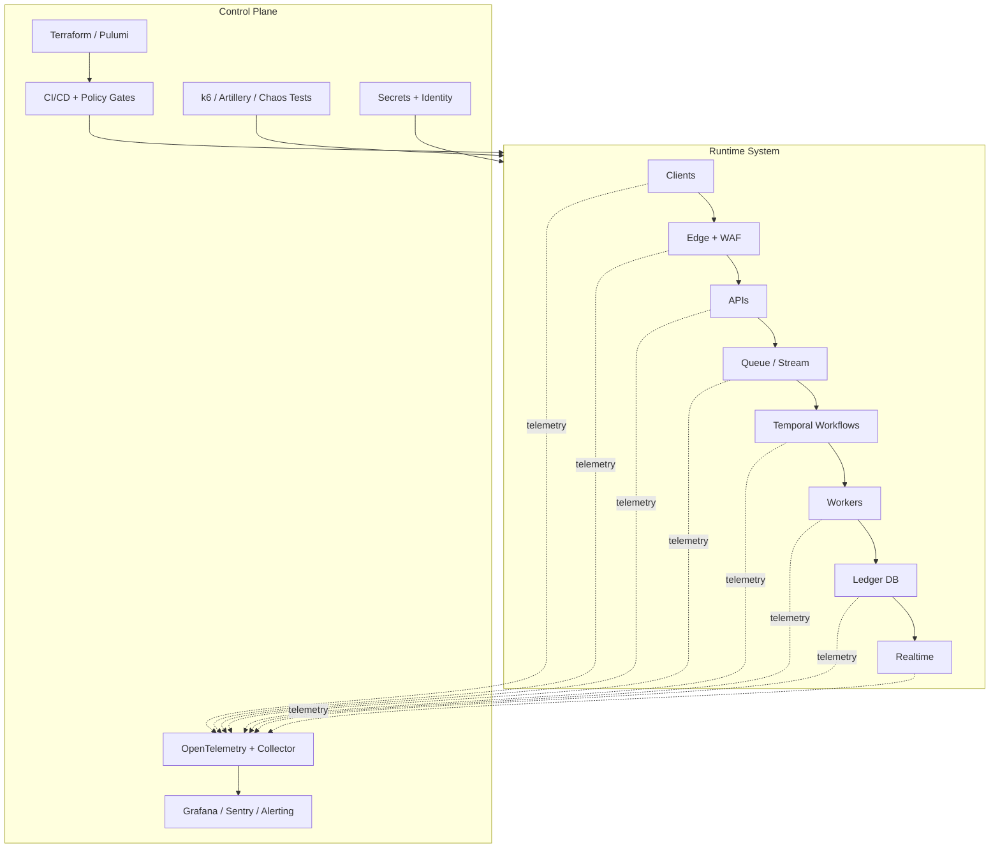

# Business Hub Production Control Plane Architecture

## Purpose

This document defines the **operational control plane** required to make the extreme Business Hub transaction architecture actually deployable in production.

It sits on top of:

- [Target Platform Architecture](./target-platform-architecture.md)
- [High-Scale Global Architecture](./high-scale-global-architecture.md)
- [Ultra-High-Write Transaction Architecture](./ultra-high-write-transaction-architecture.md)

Those documents define the core data path.

This document defines the missing operational layers:

- observability
- infrastructure as code
- workflow orchestration
- client event-throttling
- chaos and load testing
- reliability and rollback operations

## Executive answer

The architecture you quoted is strong, but it is **not production-complete without an operational control plane**.

At very high scale, the hardest problems are no longer:

- picking the database
- choosing the queue
- choosing the API language

The hardest problems become:

- tracing a transaction across many systems
- provisioning regions consistently
- ensuring workers never lose a stateful validation flow
- preventing the UI from choking on live updates
- proving the system survives real failure and load

That means the missing architecture is:

- **OpenTelemetry** for end-to-end traces, metrics, and logs
- **Terraform or Pulumi** for versioned infrastructure
- **Temporal** for resilient workflow orchestration
- **client-side event coalescing and virtualization**
- **k6 and/or Artillery** for repeatable load and chaos testing

## What this control plane protects

## Control plane layers

### 1. Observability plane

Without this, you are flying blind.

At very high scale, if a transaction is delayed or lost, raw logs are not enough.

You need:

- distributed traces
- service metrics
- structured logs
- correlation IDs
- queue lag visibility
- client-side performance telemetry

### Recommended stack

- **OpenTelemetry SDKs**
- **OpenTelemetry Collector**
- **Grafana / Tempo / Loki / Prometheus** or equivalent
- **Sentry** for application exceptions and release health

### Trace propagation model

Every transaction should carry a shared identity across systems:

- `trace_id`
- `span_id`
- `request_id`
- `client_tx_id`
- `shop_id`
- `user_id`
- `device_id`

### Required trace path

### Critical observability signals

#### Traces

- end-to-end transaction path
- queue publish and consume timing
- worker validation duration
- commit latency
- fanout latency

#### Metrics

- RPS by route and region
- queue lag
- worker throughput
- dead-letter rate
- commit failures
- replica lag
- websocket connection counts
- client frame drops / render stalls where measurable

#### Logs

- structured JSON logs only
- no free-form ad hoc logs on critical services
- all logs correlated to `trace_id`

### Error budgets and SLOs

Define explicit service targets:

- p95 ingestion latency
- p99 commit confirmation latency
- queue backlog ceiling
- worker retry rate
- real-time fanout delay ceiling
- client frame budget for hot screens

This is what turns "zero lag" into measurable engineering goals.

## 2. Infrastructure as code plane

This system should never be built by clicking around cloud consoles.

### Recommended tools

- **Terraform** as default recommendation
- **Pulumi** if you want programmatic IaC in TypeScript/Go/Python

### What must be codified

- networks
- regions
- CDN/WAF configuration
- queues
- worker deployments
- database instances and replicas
- storage buckets
- secrets wiring
- telemetry collectors
- dashboards and alerts where possible
- CI/CD deployment policies

### Why this matters

At scale, repeatability is part of reliability.

If Europe traffic spikes and you need another region:

- it should be a reviewed infrastructure change
- not a midnight manual console session

### Recommended operational model

- Git-based infrastructure repo or monorepo sub-tree
- pull-request review
- environment promotion
- drift detection
- policy enforcement

## 3. Workflow orchestration plane

The moment you introduce:

- validation agents
- retries
- staged business approval logic
- asynchronous settlement-like flows

you need a **stateful workflow engine**.

### Recommended tool

- **Temporal**

### Why Temporal fits

Temporal is ideal for:

- crash-proof workflows
- long-running transaction validation
- retries with durable history
- compensation steps
- human-in-the-loop steps if needed later

### Recommended use in Business Hub

Use Temporal for workflows such as:

- transaction validation pipeline
- refund / reversal pipeline
- fraud review pipeline
- bulk import validation and apply
- nightly reconciliation
- export generation
- multi-step notification or settlement processes

### Example workflow stages

### Important rule

Kafka or Pub/Sub provides durable transport.

Temporal provides durable **process state**.

Those are different responsibilities, and both matter.

## 4. Client performance control plane

A fast backend does not guarantee a smooth UI.

If the client applies every micro-update immediately, it can still freeze.

### Web and Tauri requirements

For the admin/desktop UI:

- batch websocket events into small time windows
- coalesce duplicate updates
- update a store once per batch
- virtualize long lists and tables
- avoid one React render per micro-event

### Recommended event policy

- collect hot events over `50-100ms`
- merge them by entity or screen scope
- apply a single render update

### Flutter requirements

For mobile:

- write locally first
- process large sync merges off the main isolate where possible
- debounce non-critical visual updates
- paginate and virtualize lists
- avoid chart-heavy first paint

### Why this matters

The backend can be perfect and the app can still feel bad if:

- 500 stock events trigger 500 renders
- a list rerenders from the top on every update
- SQLite merge work blocks the UI thread

So the control plane must include **frontend event governance**, not just backend scaling.

## 5. Reliability and rollback plane

Every production-scale transaction platform needs explicit failure handling.

### Required reliability patterns

- idempotency keys
- retry policies by failure class
- dead-letter queues
- compensating workflows
- poison message detection
- replay tools
- safe operator runbooks

### Example failure cases

- client gets fast ack, worker later rejects
- worker crashes after external validation but before commit
- database commit succeeds but realtime fanout delays
- duplicate event appears after network retry
- region degrades and backlog shifts elsewhere

The system must have a documented resolution path for each.

## 6. Security and secrets plane

At very high scale, security becomes part of architecture, not a separate checklist.

### Required controls

- managed secrets storage
- short-lived credentials where possible
- mutual TLS or equivalent between critical internal services where appropriate
- per-service identity
- least-privilege queue and database access
- audit logging for operator actions
- WAF and abuse controls at the edge

### Client trust model

Clients should never be trusted as transaction truth.

They are optimistic UX surfaces.

Final truth is established by:

- validation workflows
- commit service
- ledger database

## 7. Load and chaos engineering plane

If this architecture is supposed to survive high load, you must prove it.

### Recommended tools

- **Grafana k6**
- **Artillery**

### What to test

#### Load tests

- steady-state API throughput
- spike tests
- soak tests
- websocket fanout under concurrent load
- client offline-sync burst ingestion

#### Chaos tests

- worker crash mid-validation
- queue latency spike
- replica lag increase
- region loss simulation
- partial realtime outage
- Redis node failover
- delayed storage dependency

### Test outcomes that matter

- no dropped committed transaction
- bounded queue recovery
- graceful client degradation
- measured failover behavior
- known recovery time objectives

## 8. Release and change management plane

At this complexity, deployment discipline matters.

### Minimum standards

- progressive rollout
- canary deployment
- feature flags
- schema migration discipline
- backward-compatible event contracts
- rollback playbooks

### Database rule

Never tie app rollout to risky schema changes without:

- migration staging
- compatibility windows
- rollback strategy

## 9. Operational dashboards

The team should have dashboards for:

- region health
- queue lag
- worker fleet health
- commit latency
- realtime fanout latency
- client crash and render health
- top rejection reasons
- idempotency collision rate
- database contention and replication lag

These dashboards should exist before the system is called production-ready.

## 10. Recommended deployment control architecture

## Business Hub recommendation

### Is this “the best” architecture?

If the goal is **true ultra-high-write global transaction processing**, then this is the missing production layer that makes the extreme architecture credible.

### Is it the best architecture for Business Hub right now?

Probably not as the first move.

For current Business Hub, this is best understood as:

- the **future operational blueprint**
- not the **day-one implementation target**

### Practical recommendation

Build toward it in phases:

1. strong Postgres-first core
2. OpenTelemetry everywhere
3. IaC from the beginning
4. workers and durable queues
5. Temporal for multi-step workflows
6. client event batching and virtualization
7. load testing and chaos before major scale jumps

## Final recommendation

The architecture in the quoted note is good, but only when completed with:

- an observability plane
- an IaC plane
- a workflow orchestration plane
- a client performance control plane
- a chaos and load-testing plane

That is the complete, deployable version of the extreme-scale Business Hub architecture.

## References

- [OpenTelemetry Overview](https://opentelemetry.io/docs/)
- [OpenTelemetry Specification Overview](https://opentelemetry.io/docs/specs/otel/overview/)
- [OpenTelemetry Collector](https://opentelemetry.io/docs/collector/)
- [Terraform Overview](https://developer.hashicorp.com/terraform/docs)
- [What is Terraform](https://developer.hashicorp.com/terraform/intro)
- [Pulumi Infrastructure as Code](https://www.pulumi.com/docs/iac/)
- [Temporal Platform Documentation](https://docs.temporal.io/)
- [Grafana k6 Documentation](https://grafana.com/docs/k6/latest/)
- [Artillery Load Testing](https://www.artillery.io/docs/get-started/load-testing)

