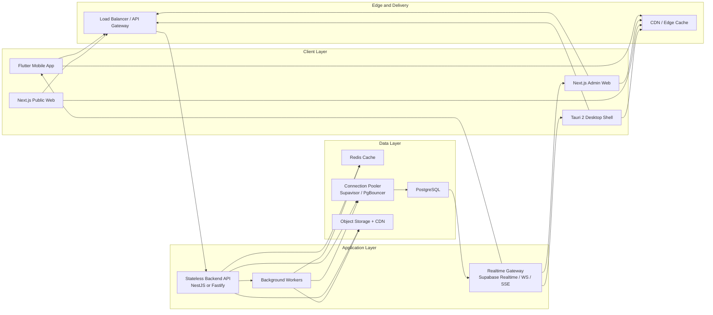
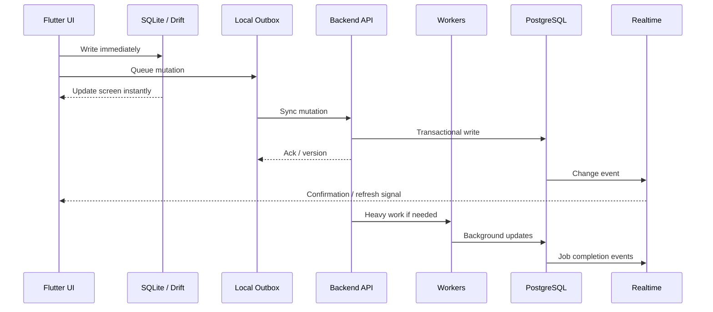

# Business Hub Target Platform Architecture

## Purpose

This document defines the recommended future-state architecture for Business Hub if the platform evolves into:

- `3+` frontends
- `1` shared backend platform
- a PostgreSQL-first system of record
- a local-first mobile experience
- selective realtime instead of "everything live all the time"

This is the recommended architecture for:

- smooth mobile performance
- large catalog and transaction volumes
- better reporting and analytics
- safer long-term scaling than the current Firebase-first document model

## Executive recommendation

For Business Hub, the best next architecture is:

- **Flutter** for mobile
- **Next.js** for admin web
- **Next.js public web** for marketing / onboarding / public surfaces
- **Tauri 2 desktop shell** wrapping the admin web where native desktop packaging is needed
- **one backend API** for business logic
- **PostgreSQL** as the primary transactional database
- **Redis** for cache, sessions, hot counters, and short-lived coordination
- **Supabase** as the platform accelerator around Postgres:
  - Auth
  - Realtime
  - Storage
  - connection pooling
- **background workers** for imports, summaries, exports, and heavy jobs

## Why this is the right fit

The current Business Hub workload is not a simple social feed or document-sync problem. It is a business operations system with:

- inventory ledgers
- sales and payments
- customer balances
- attendance and staffing
- imports and exports
- dashboards and reporting
- future multi-client consistency needs

That type of system benefits most from:

- relational data
- transactions
- aggregate queries
- strong constraints
- row-level security
- partitionable large tables

That is why PostgreSQL should become the long-term cloud source of truth.

## Target system map

## Frontend strategy

### 1. Flutter mobile app

This should become the main mobile product.

Responsibilities:
- POS
- inventory operations
- customer lookup and balance handling
- offline-first workflow
- local SQLite cache and outbox

Rules:
- local SQLite is the speed layer
- UI updates optimistically
- sync runs in the background
- heavy parsing and report shaping move to isolates

### 2. Next.js admin web

This should become the main browser-based admin surface over time.

Responsibilities:
- shop administration
- reporting
- history
- reconciliation
- settings
- team workflows

Why Next.js:
- strong server rendering and caching model
- good CDN integration
- easier route-based code splitting
- better path to a clean public web + admin web split

### 3. Next.js public web

This should stay lighter than the admin product.

Responsibilities:
- landing pages
- onboarding
- pricing
- lead capture
- public resources

This must not share the heavy admin runtime.

### 4. Tauri desktop shell

Use Tauri only where packaged desktop delivery matters:

- local desktop distribution
- native printing and device integration
- low memory desktop packaging

The desktop app should reuse the admin web frontend rather than become a separate fourth product with custom business logic.

## Backend strategy

### One backend, many frontends

Every frontend should talk to the same backend platform.

That backend should be split into these responsibilities:

### API layer

Recommended:
- `NestJS` if you want stronger enterprise structure
- `Fastify` if you want the leanest Node runtime

Recommended default for Business Hub:
- **NestJS modular monolith first**

Why:
- easier to move quickly than microservices
- clear module boundaries
- simple deployment
- still allows later extraction of worker-heavy modules

Suggested backend modules:
- auth
- shops
- inventory
- sales
- customers
- payments
- attendance
- expenses
- reports
- imports
- exports
- notifications
- admin/security

### Realtime layer

Use realtime only for:

- sale completion confirmations
- stock changes that affect active sessions
- job progress
- notifications
- presence / device status

Do **not** make every screen depend on permanent live subscriptions.

The rule should be:
- query first
- cache aggressively
- subscribe only where the user needs live awareness

### Worker layer

Workers should handle anything expensive or bursty:

- CSV and Excel imports
- PDF generation
- dashboard snapshot refreshes
- inventory velocity recompute
- customer ledger rebuilds
- nightly summaries
- exports
- anomaly detection
- scheduled jobs

The API should enqueue and return quickly.

## Data strategy

### System of record

PostgreSQL becomes the main cloud transactional database.

Use it for:
- shops
- users
- memberships
- inventory
- inventory batches / variants
- customers
- sales
- sale_items
- sale_payments
- returns
- expenses
- staff
- attendance
- notifications
- jobs
- audit logs

### Redis

Use Redis only for hot operational acceleration:

- session-adjacent cache
- rate limiting
- dashboard hot counters
- short TTL shop config cache
- outbox coordination / idempotency helpers
- websocket fanout helpers if needed

Redis should not become the source of truth.

### Object storage

Use object storage for:

- images
- receipts
- PDF exports
- bulk import source files
- backup bundles

Serve large files directly from storage/CDN, not through the app API.

## Recommended database model

### Core relational tables

Recommended core entities:

- `users`
- `shops`
- `shop_memberships`
- `devices`
- `inventory_items`
- `inventory_variants`
- `inventory_stock_ledger`
- `customers`
- `customer_ledger_entries`
- `sales`
- `sale_items`
- `sale_payments`
- `expenses`
- `attendance_sessions`
- `jobs`
- `job_events`
- `notifications`
- `audit_events`

### Summary and derived tables

Do not compute major dashboard values from raw rows in the client.

Maintain summary tables such as:

- `shop_daily_metrics`
- `shop_monthly_metrics`
- `inventory_low_stock_snapshot`
- `inventory_velocity_snapshot`
- `customer_balance_snapshot`
- `staff_attendance_daily_summary`
- `sales_payment_mix_daily`
- `dashboard_snapshot_current`

### Partitioning plan

Plan partitioning early for large write-heavy tables:

- `sales`
- `sale_items`
- `sale_payments`
- `inventory_stock_ledger`
- `customer_ledger_entries`
- `attendance_sessions`
- `audit_events`
- `job_events`

Recommended partition keys:

- `shop_id`
- time range, usually month-based

Practical pattern:
- partition by date range for time-series tables
- optionally sub-partition by hash of `shop_id` later if required

## Mobile data flow

The mobile app should be local-first, not cloud-first.

Rules:
- local cart and catalog reads must never wait on cloud
- every mutation should be idempotent
- every sync write should carry device and version metadata
- conflict handling should prefer append-only ledgers over overwriting raw facts

## Read path strategy

### Fast path

Use this for common user screens:

1. client reads local cache first
2. API reads Redis if server-side data is needed
3. API falls back to Postgres only on cache miss or strong consistency cases
4. client receives lightweight payloads shaped for the screen

### Slow path

Use this for heavy reports:

1. client requests report
2. API creates job
3. worker builds report
4. result is stored in object storage
5. realtime or polling notifies client

## Write path strategy

Every important write should be transactional in Postgres.

Example:
- create sale
- create sale_items
- create payment records
- append stock ledger movement
- update summary tables or enqueue summary refresh
- emit realtime event

That entire write should be owned by the backend, not by the client directly.

## Authentication and authorization

Recommended path:
- use **Supabase Auth** for identity
- use JWT access tokens
- enforce **Postgres Row Level Security** for direct data surfaces where appropriate
- keep complex business authorization inside the API service

Recommended permission model:
- user identity in Auth
- tenancy and role membership in `shop_memberships`
- feature-level rules in backend modules

Do not let every client talk directly to every core table with broad service privileges.

## Performance principles

### Client

- optimistic UI
- route-based code splitting
- virtualized large lists
- paged queries everywhere
- cache screen-sized payloads
- use Flutter isolates for heavy local parsing and transforms

### API

- stateless
- horizontally scalable
- short request handlers
- offload anything heavy to workers

### Database

- proper indexes by shop and time
- summary tables for dashboards
- partition large tables
- connection pooling from day one

### Realtime

- selective subscriptions
- narrow payloads
- use broadcast/change events as a freshness signal, not as the only read model

## Deployment topology

Recommended deployment pattern:

- **Admin Web / Public Web**: Vercel or Cloudflare + CDN
- **Backend API**: Cloud Run, Fly.io, Railway, or a container platform close to the database region
- **Postgres platform**: Supabase Postgres
- **Connection pooling**: Supavisor or dedicated PgBouncer
- **Redis**: Upstash, ElastiCache, or managed Redis close to API region
- **Storage**: Supabase Storage or S3-compatible object storage

Region strategy:

- keep the database and API in the same primary region
- place CDN at the edge globally
- place workers near the primary database region

## Recommended Business Hub target stack

### Frontends

- Flutter mobile
- Next.js admin web
- Next.js public web
- Tauri desktop shell for packaged desktop

### Backend

- NestJS API
- worker process using the same domain modules

### Platform

- Supabase Auth
- Supabase Postgres
- Supabase Realtime
- Supabase Storage
- Supavisor / dedicated PgBouncer

### Supporting services

- Redis
- Sentry
- OpenTelemetry
- scheduled jobs

## Migration path from the current repo

### Phase 1 - keep what works

- keep the current React/Vite web app alive
- continue Flutter mobile migration
- stop expanding Firebase-first architecture for new heavy domains

### Phase 2 - introduce new backend

- stand up Postgres schema
- create backend API modules
- start dual-writing or domain-by-domain migration

### Phase 3 - move mobile critical flows first

- auth/session
- inventory
- POS
- customers

### Phase 4 - migrate admin/reporting

- history
- expenses
- team
- settings
- analytics

### Phase 5 - retire Firebase-heavy operational logic

- keep only what is still useful
- remove direct business dependence on Firestore for core OLTP

## Final recommendation

If the goal is:

- smoother mobile
- better handling of large data
- less UI lag
- safer long-term scale
- more professional backend architecture

then the best Business Hub target architecture is:

- **multi-frontend**
- **one backend API**
- **PostgreSQL as primary truth**
- **Redis for speed**
- **workers for heavy tasks**
- **selective realtime**
- **SQLite on device for mobile speed**

This is the architecture I would recommend building toward from the current codebase.

## References

- [Supabase Architecture](https://supabase.com/docs/architecture)
- [Supabase Realtime Architecture](https://supabase.com/docs/guides/realtime/architecture)
- [Supabase Connection Management](https://supabase.com/docs/guides/database/connection-management)
- [Supabase Connection Pooling / Pooler Modes](https://supabase.com/docs/reference/postgres/connection-strings)
- [PostgreSQL Logical Replication](https://www.postgresql.org/docs/current/static/logical-replication.html)
- [PostgreSQL Table Partitioning](https://www.postgresql.org/docs/current/static/ddl-partitioning.html)
- [Flutter Performance Best Practices](https://docs.flutter.dev/perf/best-practices)
- [Flutter Concurrency and Isolates](https://docs.flutter.dev/perf/isolates)
- [Next.js Caching Guide](https://nextjs.org/docs/app/guides/caching)
- [Next.js CDN Caching Guide](https://nextjs.org/docs/app/guides/cdn-caching)
