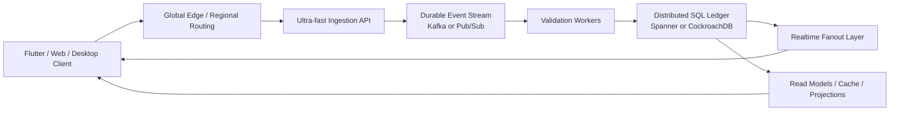
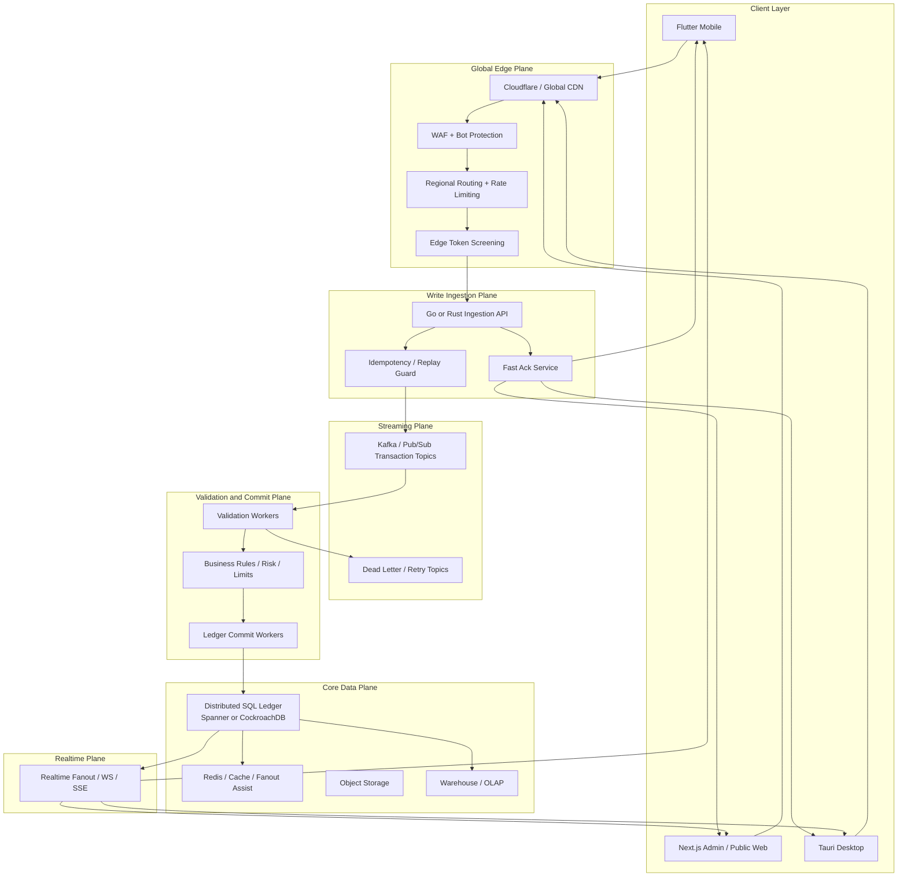

# Business Hub Ultra-High-Write Transaction Architecture

## Purpose

This document defines the **extreme-scale** architecture for Business Hub if the product ever evolves into a system that must handle:

- globally distributed financial-grade writes
- strict ACID-compliant ledger behavior
- near-real-time cross-region propagation
- very high sustained transaction ingestion

This is the architecture for a future where Business Hub behaves less like a standard ERP SaaS product and more like a:

- payment network
- banking core
- exchange-grade transaction engine
- high-volume multi-region retail settlement platform

This is **not** the default recommendation for current Business Hub.

It is the architecture to use only if the platform reaches a write profile that pushes beyond what a single-primary PostgreSQL design should carry comfortably.

## Executive answer

If the system truly needs:

- `100,000` ACID write transactions per second
- cross-region confirmation under roughly one second
- strict ledger ordering
- low write contention

then the architecture must change in three major ways:

1. **Distributed SQL replaces single-primary Postgres for the core ledger.**
2. **An ingestion stream sits between the API and the ledger database.**
3. **Transaction validation becomes an asynchronous but deterministic commit pipeline.**

In other words:

- API does not directly hammer the ledger database.
- Clients see immediate optimistic acknowledgement.
- Durable commit happens through a validated event pipeline.

## When this architecture is appropriate

Use this architecture only if Business Hub eventually needs all or most of the following:

- globally active writes from many regions at once
- extremely high transaction concurrency
- financial-grade sequencing and auditability
- independent horizontal scaling of ingestion, validation, and commit
- low tolerance for database-primary bottlenecks

If Business Hub remains a high-growth ERP / POS / inventory platform rather than a global payment rail, the Postgres-first architecture in [Target Platform Architecture](./target-platform-architecture.md) is still the better choice.

## Core idea

The system becomes a **multi-stage transaction platform**:

## Recommended technology direction

### 1. Global ledger database

Recommended candidates:

- **Google Cloud Spanner**
- **CockroachDB**

### Why these databases

Because they are designed for:

- distributed SQL
- multi-region placement
- transactional consistency across regions
- horizontal distribution of data and writes

### Practical interpretation

- **Cloud Spanner** is the stronger managed-enterprise answer if the business is comfortable with Google Cloud and premium infrastructure cost.
- **CockroachDB** is the better "Postgres-like operational mindset with distributed SQL" answer if you want more deployment flexibility.

## Global target architecture

## Why single-primary PostgreSQL stops being ideal here

At very high global write rates, the bottlenecks become:

- write coordination on one primary
- lock contention
- disk and WAL pressure
- cross-region latency to the primary writer
- pressure on connection handling even with poolers

This does **not** mean PostgreSQL is weak.

It means that if the system truly reaches payment-rail scale, the architecture must optimize for:

- distributed write locality
- cross-region transaction ordering
- multi-region resilience

That is where distributed SQL becomes the right class of tool.

## Ingestion architecture

### The API becomes a shock absorber, not the ledger writer

At this scale, the ingestion API must do almost nothing except:

- authenticate
- validate schema shape
- assign request metadata
- enforce idempotency
- publish to the transaction stream
- return fast acknowledgement

This API should not:

- compute large business rules
- wait on downstream document generation
- block on analytics updates
- synchronously rebuild inventory summaries

### Recommended runtime

For the ingestion service:

- **Go** or **Rust**

Why:

- lower garbage collection risk than a large Node.js ingestion tier
- strong concurrency behavior
- predictable memory profile
- good fit for a narrow, hot path

### Keep NestJS where it still fits

The broader business platform can still use NestJS for:

- admin APIs
- reports
- settings
- less latency-critical workflows

But the **transaction ingestion microservice** should be treated as a separate performance-critical service.

## Durable event stream

Use one of:

- **Apache Kafka**
- **Google Cloud Pub/Sub**

### Kafka fits when:

- event replay matters deeply
- partition control matters
- multiple downstream consumers need precise stream behavior
- you want long-lived stream semantics

### Pub/Sub fits when:

- you want a fully managed globally scalable message bus
- you want to avoid operating Kafka
- GCP alignment is acceptable

### Suggested decision

- choose **Pub/Sub** if the platform goes deep into Google Cloud and Spanner
- choose **Kafka** if multi-cloud portability and advanced event-stream control are top priorities

## Transaction lifecycle

### Step 1: client optimistic write

The client writes locally first:

- Flutter writes to local SQLite
- desktop/web updates UI optimistically

The user sees immediate success-pending state.

### Step 2: edge route

Traffic is routed to the nearest ingestion region:

- India users to India-adjacent edge/API
- Europe users to Europe-adjacent edge/API
- US users to US-adjacent edge/API

### Step 3: ingestion API

The ingestion service:

- validates the token
- checks request signature and schema
- applies idempotency key checks
- assigns trace and event IDs
- publishes the transaction event
- returns acceptance response quickly

### Step 4: validation workers

Workers consume the event and run business validations.

### Step 5: commit

If valid:

- commit to the distributed ledger database

If invalid:

- reject
- emit a failure event
- instruct clients to roll back or repair

### Step 6: read model and fanout

After commit:

- publish a completion event
- update cache and projections
- notify affected clients

## Validation pipeline

This is the most important part of the architecture.

Before a transaction reaches the permanent ledger, workers should validate:

### Identity and authorization

- authenticated user identity
- valid device registration if enforced
- valid shop membership
- role permission for this operation
- revoked session or compromised device checks

### Idempotency

- duplicate request detection
- retry-safe replay handling
- same `client_tx_id` not already committed
- same payment reference not already used

### Payload integrity

- schema validation
- required fields present
- type-safe values
- currency precision correctness
- unit quantity correctness
- forbidden negative or malformed values

### Business invariants

- product exists
- customer exists if required
- staff is assigned correctly
- tax mode matches policy
- sale date is valid
- inventory policy allows the operation

### Ledger consistency

- debit and credit sides balance where needed
- stock movement entries reconcile with sale quantity
- payment totals match sale totals
- rounding policy matches configured system rules

### Inventory and pricing checks

- current sellable stock availability
- forced-sale policy allowed or not
- price override allowed or not
- discount cap not exceeded
- barcode/SKU resolves to correct entity version

### Fraud / abuse / anomaly checks

- impossible discount patterns
- burst duplicate sales
- suspicious refund velocity
- region/device mismatch
- repeated failure or replay attempts

### Concurrency and sequencing

- stale version checks
- optimistic concurrency conflict resolution
- lock or compare-and-swap checks on critical counters
- ordering rules for dependent events

### Limits and compliance

- per-shop transaction limit
- per-device rate safety
- compliance rules for large transactions
- audit trail completeness

## Ledger write model

The ledger should be append-first where possible.

Recommended principles:

- immutable transaction records
- correction entries instead of destructive overwrite
- explicit journal / movement rows
- separate projections for UI convenience

For example:

- `transactions`
- `transaction_items`
- `inventory_movements`
- `payment_movements`
- `customer_ledger_entries`
- `audit_events`

The UI should mostly read projections and summaries, not raw journals.

## Read-model architecture

At this scale, the ledger is not the main user query surface.

Create read models for:

- dashboard KPIs
- current stock by item
- open customer balance
- recent sales list
- live shift metrics
- notification counters

These can be:

- distributed SQL tables optimized for reads
- Redis materializations
- warehouse tables for deep analytics

## Realtime fanout

Once committed, events should propagate through a thin fanout layer.

### Recommended pattern

- ledger commit event
- project to realtime topic
- push lightweight event to subscribed clients

Examples:

- `TX_COMMITTED`
- `TX_REJECTED`
- `STOCK_CHANGED`
- `JOB_PROGRESS`
- `BALANCE_UPDATED`

### Redis role here

Redis can still help for:

- ephemeral fanout coordination
- hot state
- short-lived websocket subscription state

But Redis should not be the durable truth for committed financial events.

## Regional strategy

### Write regions

Use several write-capable regions close to demand clusters.

### Data placement

For distributed SQL:

- data locality should align with shop geography when possible
- reads and writes for a shop should usually stay close to that shop’s home region

### Why this matters

The speed of light is real.

Even with a world-class architecture, global writes still need smart locality rules if you want low latency.

## Recommended deployment topology

### If choosing Google Cloud-first

- Cloudflare at the edge
- Go ingestion API on GKE / Cloud Run
- Pub/Sub for event stream
- Spanner for global ledger
- Memorystore / managed Redis for hot cache
- BigQuery for analytics
- object storage on GCS

### If choosing Cockroach-first

- Cloudflare at the edge
- Go ingestion API on Kubernetes / managed container platform
- Kafka or durable managed queue
- CockroachDB multi-region cluster
- managed Redis
- object storage
- separate analytics store later

## Client behavior

### Flutter mobile

- write locally first
- show pending state
- sync to ingestion API
- reconcile on commit or reject
- keep an offline outbox with strong IDs

### Web and desktop

- optimistic UI for operator actions
- pending status markers for critical writes
- subtle rollback message if validation fails

## Failure model

This architecture must expect failures as normal.

### Required failure handling

- duplicate submissions
- partial region outage
- worker crash during validation
- queue backlog spike
- client reconnect and replay
- commit succeeded but fanout delayed
- commit rejected after optimistic UI success

### Recovery rules

- no silent drops
- every transaction has durable status
- every event traceable end-to-end
- every client can rehydrate from authoritative read model

## Observability requirements

This architecture is impossible to operate safely without strong telemetry.

Minimum required:

- distributed tracing from client request to commit
- queue lag metrics
- validation failure metrics
- per-region ingestion latency
- commit latency
- websocket fanout latency
- replay / duplicate counters
- dead-letter volume

## Cost and complexity warning

This architecture is **expensive** and **operationally demanding**.

It is justified only if the business genuinely needs:

- global financial-grade writes at extreme throughput
- under-one-second cross-region propagation
- always-on ingestion at very high concurrency

For most real ERP and POS systems, the Postgres-first target architecture remains the better default because it is:

- much simpler
- much cheaper
- easier to ship
- easier to operate

## Business Hub recommendation

For Business Hub specifically:

- do **not** start here
- design so you can graduate here if required

Recommended progression:

1. Postgres-first architecture
2. strong queue and worker design
3. aggressive caching and projections
4. read replicas and regional expansion
5. only then evaluate distributed SQL ledger architecture

## Final recommendation

If you want the architecture that matches the statement you quoted, then the correct shape is:

- **Flutter + Next + Tauri clients**
- **edge-routed ingestion**
- **Go or Rust ingestion service**
- **Kafka or Pub/Sub durable stream**
- **validation workers**
- **distributed SQL ledger using Spanner or CockroachDB**
- **projection/read-model layer**
- **selective realtime fanout**

That is the right architecture for an ultra-high-write, globally distributed, ACID-heavy transaction platform.

## References

- [Cloud Spanner TrueTime and External Consistency](https://docs.cloud.google.com/spanner/docs/true-time-external-consistency)
- [Cloud Spanner Product Overview](https://cloud.google.com/spanner)
- [Google Cloud Pub/Sub Architecture](https://cloud.google.com/pubsub/architecture)
- [CockroachDB Multi-Region Overview](https://www.cockroachlabs.com/docs/stable/multiregion-overview)
- [CockroachDB Topology Patterns Overview](https://www.cockroachlabs.com/docs/stable/topology-development)
- [CockroachDB Transaction Layer](https://www.cockroachlabs.com/docs/stable/architecture/transaction-layer)
- [Cloudflare Workers Overview](https://developers.cloudflare.com/workers/)
- [Redis Pub/Sub Overview](https://redis.io/glossary/pub-sub/)
- [Redis Clustering Documentation](https://redis.io/docs/latest/operate/rc/databases/configuration/clustering/)
